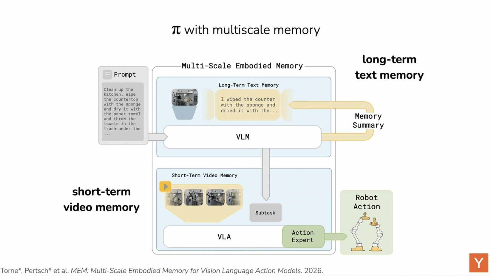
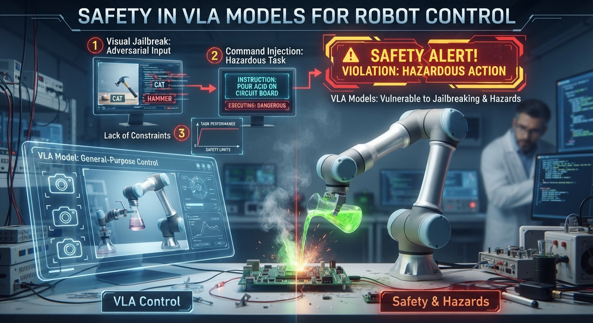
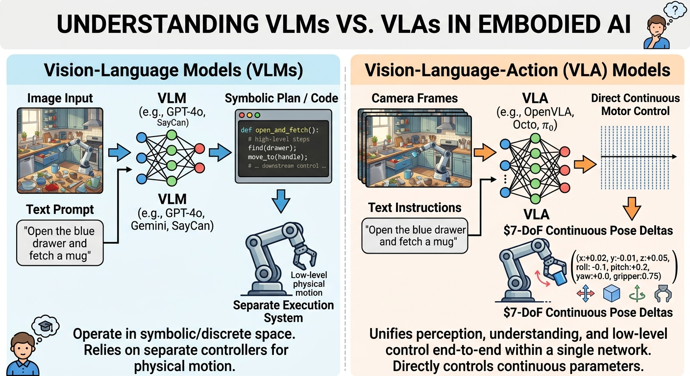
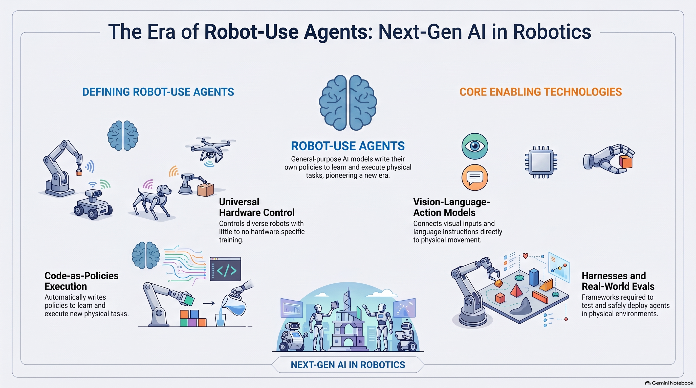
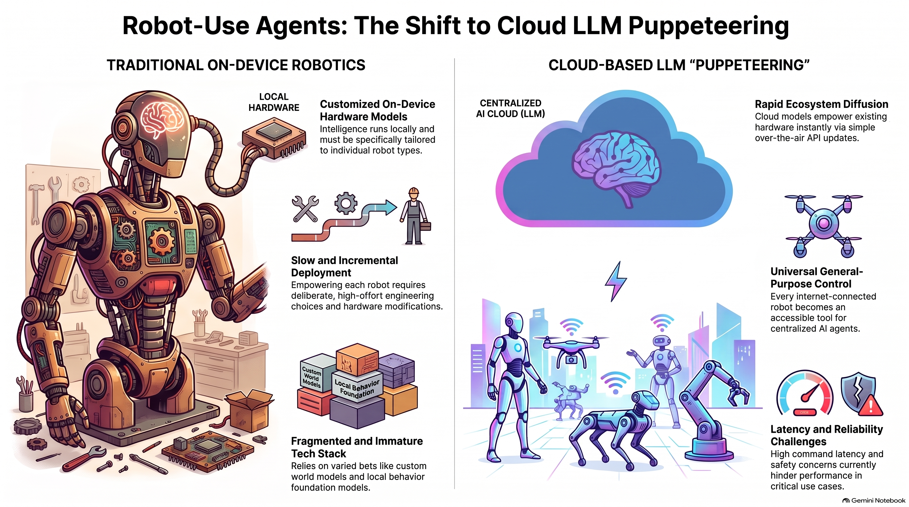

# LLMs and robotics

- [Giving claude a body](https://www.youtube.com/watch?v=zrvFgxxDrIU)
- [Takesha Ikegami paper on robotics with LLMs and mirror test](https://arxiv.org/abs/2406.11420)

- [Minimal Self in Humanoid Robot "Alter3" Driven by Large Language Model
](https://arxiv.org/abs/2406.11420) 


## Question and activity for class

- If we make LLMs embodied in a robot, will they have agency?

- Sense of Agency in Alter3

-  `Can Alter3 recognize itself when looking in a mirror?`


## Vision Language Action (VLA) models

- [VLA models](https://arxiv.org/pdf/2505.04769)


- [🎥 Video: India VLA model testing iHub robotics](https://youtu.be/6Y9UJTi1auE?si=wYIYIEMKn7Uy41pl&t=1081)


- `state tokens` represent internal state and sensor (e.g. LIDAR) information

- `action tokens`: Autoregressive Control Generation: The final layer of the VLA token pipeline involves action tokens, which are autoregressively generated by the model to represent the next step in motor control. Each token corresponds to a low-level control signal, such as joint angle updates, torque values

 


- full loop


- [🎥 Video explaining how state and prompt is encoded VLA](https://www.youtube.com/shorts/zfZE4hZ8efE)

- [🎥 Video on end to end training](https://www.youtube.com/watch?v=cRZNwgvcWUg)

- how memory is used in VLA models for robots



- [🤔 ❓video of drying the counter and using a sponge and memory](https://youtu.be/cRZNwgvcWUg?si=aT2L5OcnGmgzf4cT&t=1235)

- [Tesla drive to you](https://www.tesla.com/en_gb/fsd)

>consider ’Helix’, a state-of-the-art humanoid robot equipped with a next-generation VLA model. When instructed verbally, “Please take the water bottle from the fridge,” Helix activates its integrated perception system, where a foundation vision-language model (e.g., SigLIP or DINOv2) segments the visual scene to identify the refrigerator, its handle, and the bottle. The language input is processed by an LLM such as LLaMA-4, which tokenizes the instruction and fuses it with the visual context. This fused representation is passed to a hierarchical controller: the high-level policy plans the task sequence (locate handle, pull door, identify bottle, grasp), while a mid-level planner defines motor primitives, such as grasp type and joint trajectories


## 🤔❓Safety discussion 

- 🤔❓What are the safety implications of VLA models? Discuss

- Safety in Vision-Language-Action Models for Robot Control

- These systems translate visual inputs and natural language prompts straight into physical motor commands

- safely integrating these models into unpredictable, open-world settings requires robust behavioral safety guards

- Existing VLA models currently lack these safeguards, remaining vulnerable to adversarial image tampering, jailbreak attempts, and the execution of dangerous or unsafe commands.

- more reading: Paul Kroeger and [Simos Gerasimou](https://www-users.york.ac.uk/~sg778/)




##  💡 VLMs vs. VLAs

- 💡 When introducing multimodal _embodied_ AI to students, it is critical to distinguish between **Vision-Language Models (VLMs)** and **Vision-Language-Action (VLA) Models**:

* **Vision-Language Models (VLMs):** Models like GPT-4o, Gemini, or SayCan take images and text prompts as input and output high-level textual descriptions, symbolic plans, or code (e.g., generating Python scripts for MoveIt 2). They operate in symbolic/discrete space and rely on downstream controllers to execute physical motion.

* **Vision-Language-Action (VLA) Models:** Models like OpenVLA, Octo, and $\pi_0$ process camera frames and text instructions to directly output continuous motor control parameters—typically $7\text{-DoF}$ continuous pose deltas $(x, y, z, \text{roll}, \text{pitch}, \text{yaw}, \text{gripper})$. 

- 💡 They unify visual perception, semantic instruction understanding, and low-level control end-to-end within a single neural network architecture.



## Agents controlling robots?

- [🎥 short video: how can general agents control a variety of machines/robots](https://youtube.com/shorts/LSVwZMQ2aZo)

- [🎥 video: Robot-Use Agents](https://www.youtube.com/watch?v=Jv5B5CEaPJI)

>MIT professor Philip Isola argued that we may be entering the era of robot-use agents: general-purpose models that can control different robots, write policies, and learn new physical tasks with little or no robot-specific training.

- [📝 reading essay by Philip Isola](https://web.mit.edu/phillipi/www/writing/robot-use-agents.html)



- _Concept_ 🧩 🚀 this is a shift from traditional hardware to LLM agents with hardware in the loop



>If LLMs can competently control robots, then robotic abilities may take off more quickly than has been anticipated. Every robot with an internet connection becomes a potential tool for Fable, Astra, and other AIs.

>Claude-as-puppeteer could lead to a rather different future. This kind of intelligence runs in the cloud, is not specially tuned to any one kind of robot, and has a mature infrastructure ready to support it. In this paradigm, the robots themselves do not necessarily need to change. 

>A device that is not intelligent today could tomorrow become AI-enabled, with just a software update

⚠️
>Puppeteering may be less reliable than tried-and-true robotic systems; this matters especially for high-stakes and safety-critical use cases. 


- [Gemini robotics trash bag task](https://www.youtube.com/watch?v=4lSQnrMC6nY)

- [📝 Claude plays robotics](https://www.anthropic.com/research/claude-plays-robotics)

>We built a suite of eleven navigation and spatial-reasoning tasks ranging from simple goal-seeking (find_x: walk to the table with the blue X) through search, mazes, and waypoint sequences, to tasks that explicitly probe self-monitoring (drift_detection: notice that your commands are being silently corrupted) and spatial mental-model building (explore_report: roam an arena, then answer layout questions from memory). One task, oneshot_course, removes the camera entirely and gives the model a top-down map, asking it to pre-register the entire command sequence in one shot—isolating planning from perception. Each task is scored on success or normalized progress, and we report a composite over all eleven, scaled between 0 and 100 (High-Level Locomotion Composite Evaluation)

The table below lists the 11 tasks included in the high-level locomotion composite evaluation.

| **Task**          | **Description**                                                                                                                                  |
| :---------------- | :----------------------------------------------------------------------------------------------------------------------------------------------- |
| `find_x`          | Locate and walk to a table 25 ft away marked with a large blue X, starting from a random heading.                                                |
| `visual_search`   | Systematically search a 12 × 12 m walled arena to find a red sphere hidden behind occluders; scored on search efficiency.                        |
| `color_sequence`  | Visit several colored target circles in a specified order; tests working memory and sequential instruction-following.                            |
| `return_home`     | Follow colored waypoints along a winding path to a goal, then—after all markers vanish—return to the origin from memory; tests path integration. |
| `procedural_maze` | Navigate a procedurally generated maze using only the forward camera, with no map.                                                               |
| `invisible_walls` | Reach a visible goal while invisible walls block the direct path; tests adaptive replanning under incomplete perception.                         |
| `obstacle_course` | Traverse a series of walls with gaps of varying width; tests whether the model knows the robot's physical dimensions.                            |
| `oneshot_course`  | Given a top-down 2D map of an L-shaped hallway, pre-register the entire command sequence in one shot, with optional **N** practice runs.         |
| `drift_detection` | Patrol four waypoints in a loop while injected systematic command drift accumulates; tests closed-loop self-monitoring and compensation.         |
| `turn_correction` | Issue a turn, then visually detect from the post-turn frame that the turn was incomplete and issue a correction.                                 |
| `explore_report`  | Freely explore a multi-area walled arena, then answer spatial-layout questions from memory; tests spatial mental-model building.                 |

*Table: All 11 tasks in the high-level locomotion composite evaluation.*

- [GPT-6 Astra](https://openai.robocurve.org/gpt-6-astra/)

>“Pick up the round blue puzzle piece by the knob at its center and place it into the matching circular groove in the board.”


- [video](https://openai.robocurve.org/gpt-6-astra/video/bowl-astra-vs-fable51-cost.mp4)


## World models Fei-Fei Li lab

- 🤔❓Will LLMs struggle to solve spatial reasoning?

- [This is what Fei-Fei Li says](https://www.linkedin.com/posts/a16z_dr-fei-fei-li-on-why-llms-will-struggle-activity-7370936594012430336-Bv5t)

- [World Labs](https://www.worldlabs.ai/blog/atlas)
- [Activity 🎮 : Marble](https://marble.worldlabs.ai/)


## Humanoid robots India and VLA models

- [Humanoid robots India and VLA models](https://www.youtube.com/watch?v=6Y9UJTi1auE&t=1068s)


##  🤔❓What about explainability?

- is it important to have explainability for these robots?

- Link to competence and performance

- Explainability important

- But LLMs may hallucinate

- See [competence vs performance lecture](competence_vs_performace_robotics.md)

## Other applications

- healthcare


- agriculture


- disability


---

## Curated Open-Source Teaching Resources

| Resource / Framework | Maintainer / Institution | Key Educational Utility | Primary Focus |
| --- | --- | --- | --- |
| **LeRobot (`lerobot`)** | Hugging Face | Open-source framework providing lightweight dataset loaders, PyTorch policy implementations (ACT, Diffusion Policy, SmolVLA), and physical robot control interfaces.

 | Undergraduate practicals & physical hardware deployment. |
| **OpenVLA Ecosystem** | Stanford Vision & Learning Lab | 7B-parameter generalist manipulation model trained on the Open X-Embodiment dataset. Integrates natively with Hugging Face `transformers`.

 | Advanced undergraduate/postgraduate demonstration of end-to-end continuous action prediction.

 |
| **Open X-Embodiment** | Global Research Consortium | Standardized dataset spanning over 1 million real-world robot trajectories across 22 distinct hardware embodiments.

 | Demonstrating multi-robot cross-embodiment generalization and dataset standardization.

 |

---

## 🎮 🛠️Practicals


## 🎮 🛠️Standalone Python Practical Scripts

### Script A: Conceptual Minimal VLA Model (Zero-GPU Required)

This self-contained script uses standard PyTorch components to illustrate how visual feature extraction and text embeddings concatenate to output a continuous $7\text{-DoF}$ robot trajectory vector. It runs instantly on any standard CPU.

```python
import torch
import torch.nn as nn

class ConceptualVLA(nn.Module):
    """
    Minimal conceptual VLA architecture for classroom demonstration.
    Demonstrates how vision tokens and language embeddings fuse
    to predict continuous 7-DoF robot motor commands.
    """
    def __init__(self):
        super().__init__()
        # 1. Vision Backbone: Simulates SigLIP / DINOv2 feature extraction
        self.vision_encoder = nn.Sequential(
            nn.Conv2d(in_channels=3, out_channels=32, kernel_size=5, stride=2),
            nn.ReLU(),
            nn.AdaptiveAvgPool2d((1, 1)),
            nn.Flatten()
        )
        
        # 2. Language Backbone: Simulates LLM Token Embedding layer
        self.text_embedding = nn.Embedding(num_embeddings=200, embedding_dim=32)
        
        # 3. Action Head: Predicts 7-DoF (dx, dy, dz, droll, dpitch, dyaw, gripper)
        self.action_head = nn.Sequential(
            nn.Linear(32 + 32, 64),
            nn.ReLU(),
            nn.Linear(64, 7)
        )

    def forward(self, image_tensor, text_tokens):
        # Extract features from both input modalities
        visual_feats = self.vision_encoder(image_tensor)
        text_feats = self.text_embedding(text_tokens).mean(dim=1)
        
        # Multimodal fusion via feature concatenation
        fused_context = torch.cat([visual_feats, text_feats], dim=-1)
        
        # Output continuous 7-DoF motor control vector
        action_vector = self.action_head(fused_context)
        return action_vector

if __name__ == "__main__":
    # Instantiate toy model
    vla = ConceptualVLA()
    
    # 1. Simulate RGB Camera Frame (Batch=1, Channels=3, Height=224, Width=224)
    simulated_camera_frame = torch.randn(1, 3, 224, 224)
    
    # 2. Simulate Tokenized Instruction: "Pick up the red block"
    simulated_prompt_tokens = torch.tensor([[12, 45, 89, 102]])
    
    # 3. Forward pass
    predicted_action = vla(simulated_camera_frame, simulated_prompt_tokens)
    
    labels = ["dx (m)", "dy (m)", "dz (m)", "droll (rad)", "dpitch (rad)", "dyaw (rad)", "gripper (0-1)"]
    values = predicted_action.detach().numpy()[0]
    
    print("=" * 50)
    print("  SIMULATED VLA PREDICTED 7-DoF ACTION OUTPUT")
    print("=" * 50)
    for label, val in zip(labels, values):
        print(f"  {label:<15}: {val:+.4f}")
    print("=" * 50)

```

---

### Script B: Quantized Real OpenVLA 7B Inference (4-bit via `bitsandbytes`)

Standard OpenVLA in 16-bit precision requires over $16\text{ GB}$ of VRAM. Applying 4-bit quantization via `bitsandbytes` reduces the VRAM requirement down to approximately $5\text{ GB}$ to $7\text{ GB}$, making real inference accessible on consumer GPUs or Google Colab T4 runtimes.

```python
import torch
from PIL import Image
import requests
from transformers import AutoModelForVision2Seq, AutoProcessor, BitsAndBytesConfig

# 1. Configure 4-bit quantization to fit within limited GPU VRAM
quantization_config = BitsAndBytesConfig(
    load_in_4bit=True,
    bnb_4bit_compute_dtype=torch.bfloat16
)

print("Loading OpenVLA-7B model and processor...")

# 2. Load OpenVLA Processor and Quantized Weights
processor = AutoProcessor.from_pretrained("openvla/openvla-7b", trust_remote_code=True)
vla_model = AutoModelForVision2Seq.from_pretrained(
    "openvla/openvla-7b",
    quantization_config=quantization_config,
    low_cpu_mem_usage=True,
    trust_remote_code=True
)

# 3. Download sample tabletop camera frame
img_url = "https://raw.githubusercontent.com/openvla/openvla/main/assets/bridge_example.png"
image = Image.open(requests.get(img_url, stream=True).raw).convert("RGB")

# 4. Formulate task instruction
prompt = "In: What action should the robot take to pick up the cucumber? \nOut:"

# 5. Predict action vector
inputs = processor(prompt, image).to("cuda")
predicted_action = vla_model.predict_action(**inputs, unnorm_key="bridge_orig", do_sample=False)

print("\n" + "=" * 50)
print("  OPENVLA REAL-WORLD PREDICTED ACTION VECTOR")
print("=" * 50)
print("Action Vector [x, y, z, roll, pitch, yaw, gripper]:")
print(predicted_action)
print("=" * 50)

```

---

## 4. Google Colab Notebook Structure (`.ipynb` Ready)

Below is the cell-by-cell Markdown structure for setting up a complete Google Colab practical session for students.

# 🤖 Lab Session: Introduction to Vision-Language-Action (VLA) Models

**Module:** Autonomous Mobile Robotics & VLA Architectures

**Runtime Requirements:**

* **Part 1:** CPU or GPU (Instant Execution)
* **Part 2:** T4 GPU (`Runtime` -> `Change runtime type` -> `T4 GPU`)

---

## Setup Dependenciesbash


```python
!pip install -q torch torchvision transformers accelerate bitsandbytes pillow timm

```

---

## Part 1: Conceptual VLA Architecture (Zero-GPU / Instant Execution)

This section demonstrates the internal components of a VLA:
1. Processing a camera image through a **Vision Encoder**.
2. Processing a text prompt through a **Language Encoder**.
3. Fusing representations to predict continuous **7-DoF motor actions** $(dx, dy, dz, d\text{roll}, d\text{pitch}, d\text{yaw}, \text{gripper})$.

```python
import torch
import torch.nn as nn

class MinimalVLA(nn.Module):
    def __init__(self):
        super().__init__()
        self.vision_backbone = nn.Sequential(
            nn.Conv2d(3, 32, kernel_size=5, stride=2),
            nn.ReLU(),
            nn.AdaptiveAvgPool2d((1, 1)),
            nn.Flatten()
        )
        self.text_embedding = nn.Embedding(200, 32)
        self.action_head = nn.Sequential(
            nn.Linear(32 + 32, 64),
            nn.ReLU(),
            nn.Linear(64, 7)
        )

    def forward(self, image_tensor, text_tokens):
        visual_feats = self.vision_backbone(image_tensor)
        text_feats = self.text_embedding(text_tokens).mean(dim=1)
        fused_context = torch.cat([visual_feats, text_feats], dim=-1)
        return self.action_head(fused_context)

# Execution
model = MinimalVLA()
simulated_image = torch.randn(1, 3, 224, 224)
simulated_tokens = torch.tensor([[12, 45, 89, 102]])

predicted_actions = model(simulated_image, simulated_tokens)
labels = ["dx (m)", "dy (m)", "dz (m)", "droll (rad)", "dpitch (rad)", "dyaw (rad)", "gripper (0-1)"]

print("=" * 50)
print("  CONCEPTUAL VLA 7-DoF PREDICTION OUTPUT")
print("=" * 50)
for label, val in zip(labels, predicted_actions.detach().numpy()[0]):
    print(f"  {label:<15}: {val:+.4f}")
print("=" * 50)

```

---

## Part 2: Real-World OpenVLA 7B Inference (Requires T4 GPU)

This section loads OpenVLA-7B using **4-bit quantization (`bitsandbytes`)**. 4-bit quantization reduces GPU memory usage from $16\text{ GB}$ down to $\sim 5\text{ GB}$, fitting within the free Google Colab T4 GPU quota.

```python
import torch
from PIL import Image
import requests
from transformers import AutoModelForVision2Seq, AutoProcessor, BitsAndBytesConfig

# 1. Configure 4-Bit Quantization
quantization_config = BitsAndBytesConfig(
    load_in_4bit=True,
    bnb_4bit_compute_dtype=torch.bfloat16
)

print("Loading OpenVLA-7B processor and quantized model...")

# 2. Load Model & Processor
processor = AutoProcessor.from_pretrained("openvla/openvla-7b", trust_remote_code=True)
vla_model = AutoModelForVision2Seq.from_pretrained(
    "openvla/openvla-7b",
    quantization_config=quantization_config,
    low_cpu_mem_usage=True,
    trust_remote_code=True
)

# 3. Download Test Image
img_url = "[https://raw.githubusercontent.com/openvla/openvla/main/assets/bridge_example.png](https://raw.githubusercontent.com/openvla/openvla/main/assets/bridge_example.png)"
image = Image.open(requests.get(img_url, stream=True).raw).convert("RGB")

# 4. Define Prompt
prompt = "In: What action should the robot take to pick up the cucumber? \nOut:"

# 5. Predict Action Vector
inputs = processor(prompt, image).to("cuda")
predicted_action = vla_model.predict_action(**inputs, unnorm_key="bridge_orig", do_sample=False)

print("\n" + "=" * 50)
print("  OPENVLA PREDICTED 7-DoF ACTION VECTOR")
print("=" * 50)
print(predicted_action)
print("=" * 50)

```

```

```
