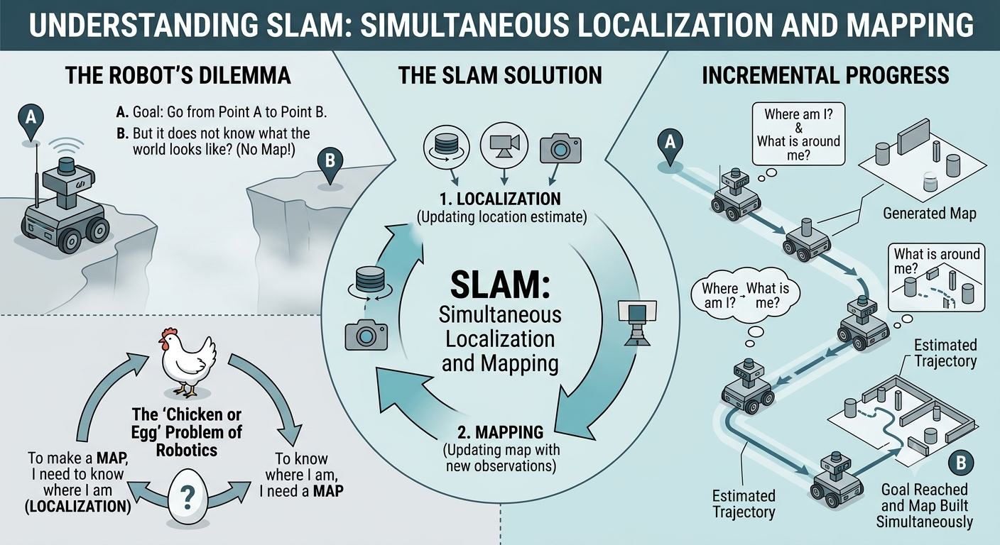
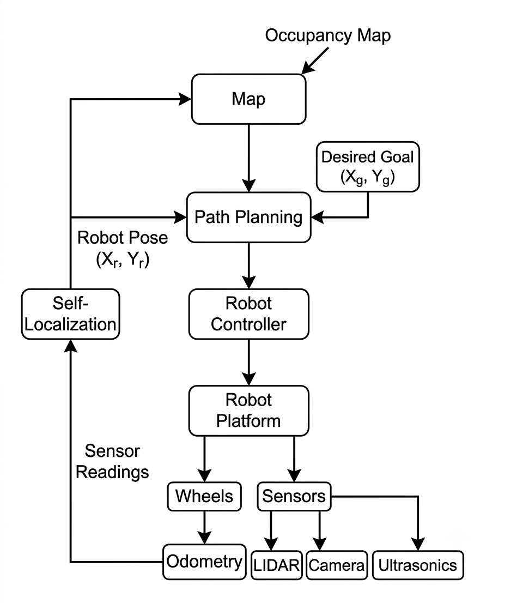
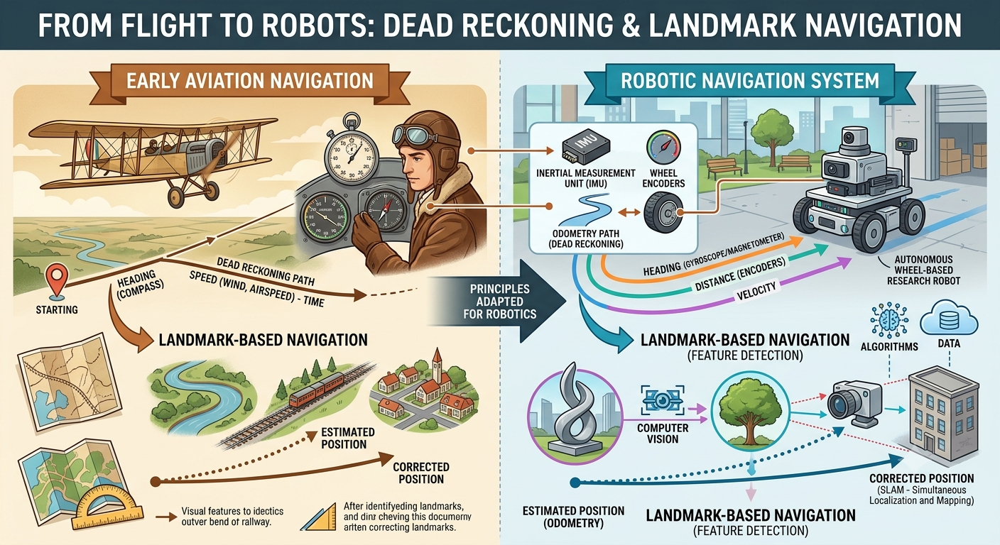
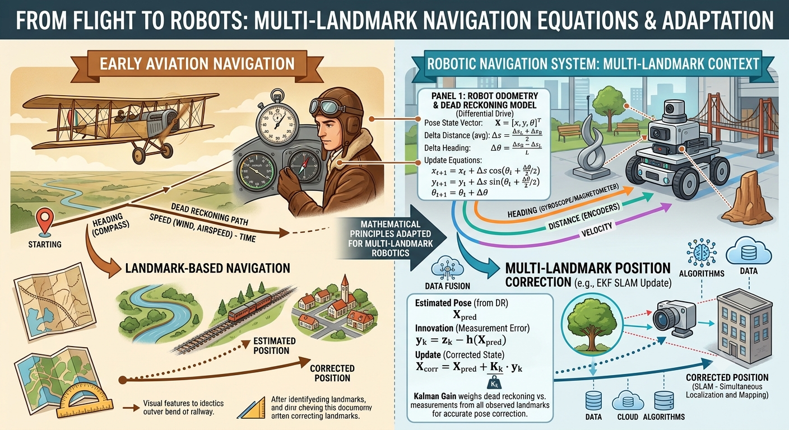
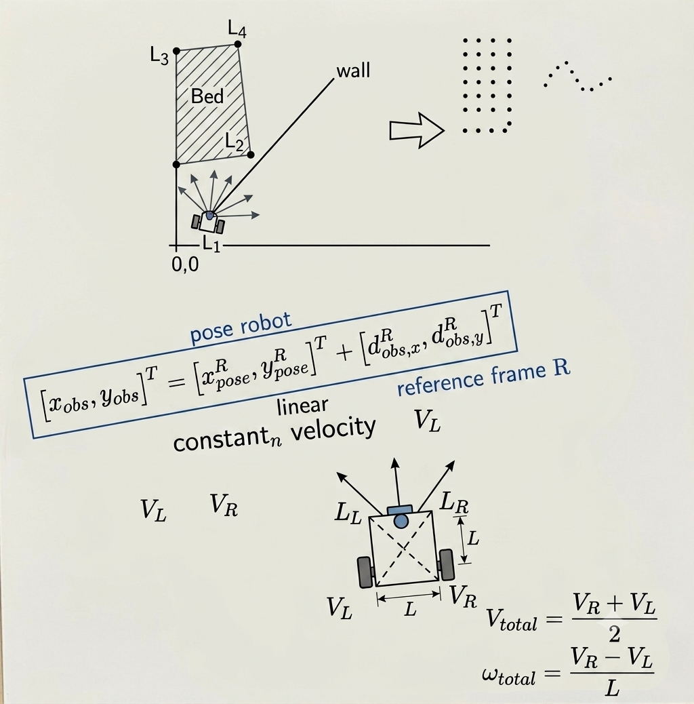
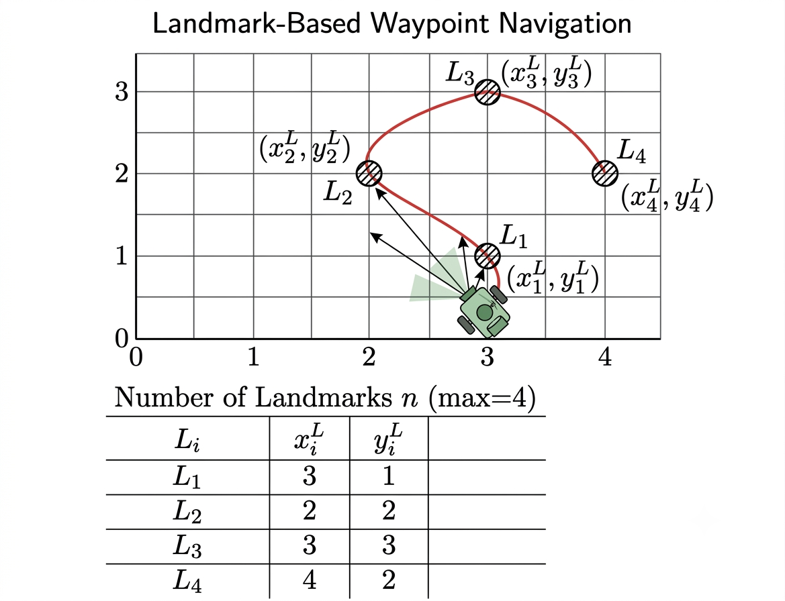
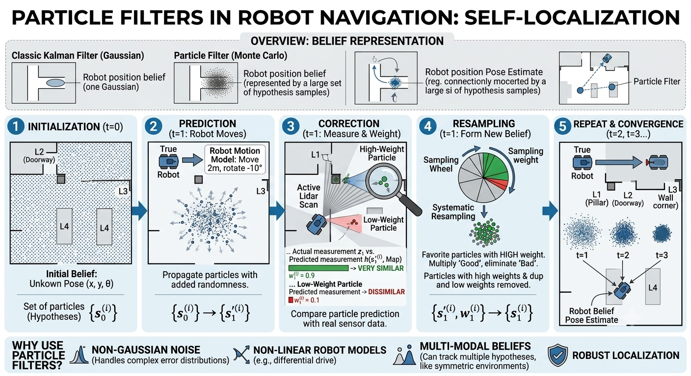
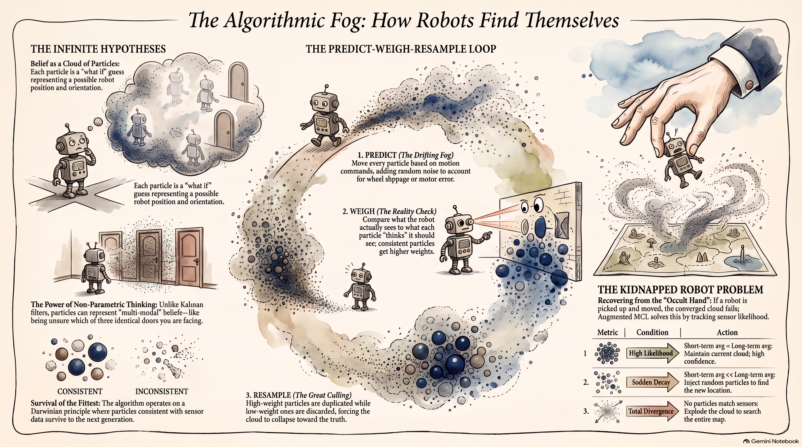
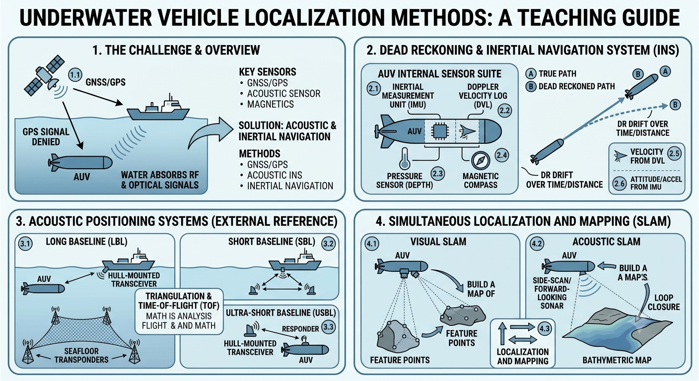

# SLAM and other algorithms

## Occupancy map

- exploration of environment

- position estimation using robot pose

- sensor values interpret (LIDAR, sonar, vision, etc.)

- integration of sensor values into map (based on distance from robot and pose estimation of robot)

## SLAM

- Simultaneous Localization and Mapping (SLAM)

- which came first: the egg or the chicken?

- robot wants to go from point A to point B: but it does not know what the world looks like?

- so it needs a map

- but what if there is no map?

- try to build a map when there is no map!

- simultaneously map and simultaneously localize

## Workflow

- wheels -> odometry

- if humanoid robot then joints

- IMU inertial measurement unit

- odometry: key to robotics platforms

- odometry assumption: robot should know where is origin (0,0,0)

- for vacuum cleaner, it is charging point. can self localize from there

- all sensor input goes to build occupancy map

- 🤔 ❓ what is the problem?

- relying too much on odomtery

- can be slippage, etc

- self localizing due to odometry can be problematic

- every rotation adds up

- map can be erroneous

- dead reckoning (early days of flight)

- `v = d/t` has a clock, how much distance travelled in a time period

- look for a particular direction on compass

- and then look for a landmark

- _LondonEye_ is a landmark for flights

- correct for drift

- greater the distance between landmarks, the greater the drift

- can miss landmark

- static 

- vacuum robot : not move chairs

- distinct landmarks and unique locations (QR codes, colours)

- database of landmarks with locations

- weights landmark more than odometry and then update location

- equations

- 🤔 ❓ imagine you have been asked to design a vacuum robot that will work in an office with glass doors. what problems will you face?

- problem with _laser_: can shine through, narrow beam

- glass may refract

- with glass room, use _ultrasound_

- design issues in industry: vacuum robot in glass offices, but office may have glass

- combinations of sensors

- landmarks may look similar

- building a robotic tour guide (in _Legoland_)

- landmarks locations known and do not move

- waypoint navigation using landmarks

## Rvis

- Rvis will show lasers as dots

## Particle Filters

- particles generated

- Initialization: The robot starts with no prior knowledge, so it scatters potential positions (particles) uniformly across the map.

- Prediction: As the robot moves, it uses its motion model, combined with added random noise to account for uncertainty, to propagate all particles.

- Correction: The robot takes sensor measurements (e.g., via Lidar). Each particle predicts what it would measure. Particles whose predictions closely match the actual measurements are given a high "importance weight."

- Resampling: A new set of particles is formed, favoring those with high weights. This effectively eliminates unlikely hypotheses and duplicates the most plausible ones

- Convergence: The process repeats, and over multiple cycles, the cloud of particles converges on the robot's actual pose.

- [🎥 Very good explanation video of particle filters](https://www.youtube.com/watch?v=ydC0mE0ZYSA)

- [🎥 Particle filters explained without equations simply](https://www.youtube.com/watch?v=aUkBa1zMKv4)

- [Video explanation created using AI by Soumya Banerjee](https://youtube.com/shorts/ooLKpnAjm3U)

- constantly resample and refine positions

- 🤔 ❓do you have a particle filter in your brain?

- you are in a room and you lose the power and lights. how would you navigate?

- you generate hypotheses, you start feeling, probing, feel the edge of the bed

- generate hypotheses, get data and test these hypotheses

- geometry of the environment becomes _features_ that the particle filter will use

- [🤔 ❓ How is this robot navigating](https://youtube.com/shorts/2biHFlMQmrE)

## Back to `NAVIGATION2`

- Map topic generated by Map server
- also generates an occupancy grid topic
- `LIDAR` node also created

- 🤔 ❓what if there is a featureless environment (marine/ocean)?	

- clock (sun), compass, weather, underwater features, celestial navigation

- [picture of celestial navigation object from TWZ](https://www.twz.com/17207/sr-71s-r2-d2-could-be-the-key-to-winning-future-fights-in-gps-denied-environments)

- underwater autonomous mapping, drill through ice, collect data on ecosystems

- how do you solve this problem?

- rely on _IMU_

- sonic/acoustic signals localize underwater

- [SLAM using sonar for underwater vehicles](https://cordis.europa.eu/article/id/152143-sonar-localisation-and-mapping-for-underwater-vehicles)

- [vision augmented navigation](https://cordis.europa.eu/article/id/465198-vision-augmented-navigation-resolves-satellite-blind-spots)

- [paper on SLAM underwater (see figure 7)](https://www.researchgate.net/publication/257523153_Scan_Matching_SLAM_in_Underwater_Environments)

## Visual SLAM

 
