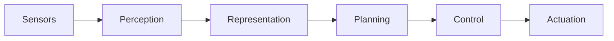

# Executive Summary  

- explainability really important

- but LLMs may hallucinate

- [competence vs performance](https://aiguide.substack.com/p/do-ai-reasoning-models-abstract-and)

- Jas Firestone’s recent PNAS perspective emphasizes the **distinction between a system’s competence (its underlying knowledge and abilities) and its observable performance**. A machine may score highly on benchmarks (high performance) yet still lack robust, generalizable competence – e.g. a vision system could classify images well but only by exploiting spurious cues. In robotics, this *performance/competence gap* can be critical: robots may complete tasks under ideal conditions yet fail catastrophically when those conditions change. This report analyzes Firestone’s argument and maps it onto the standard robotics perception–action pipeline (sensing, representation, planning, control, embodiment). We give **ROS computation-graph examples** where “superficial” solutions yield good performance on one dataset or environment but fail out-of-distribution. A comparison table catalogs common failure modes (e.g. overfit perception, “shortcut” biases, brittle planning, sim-to-real gaps) with causes, symptoms, and mitigations. We survey case studies (published experiments and incidents) illustrating performance-without-competence in robotics. Finally, we discuss implications for how we **evaluate and teach** robotics: emphasizing metrics and tests that probe competence (robustness, uncertainty), using ROS tools (simulation, logging/`rosbag`, tests, CI), and designing systems with introspection, fallback behaviors, and human oversight. We conclude with open research questions and simple classroom lab ideas to make these concepts concrete.

## 1. Firestone’s Performance vs. Competence Distinction  
Firestone (2020) draws on cognitive science (Chomsky’s linguistics) to highlight that an agent’s *competence* (its internal, idealized knowledge) can exceed its *performance* (observable behavior) if “performance constraints” interfere. **Competence** is *what the system truly knows or can do in principle*; **performance** is *how it actually behaves under test conditions*. For example, native speakers “know” grammar but may sometimes stumble on long sentences due to memory limits. Likewise, a neural net might correctly classify ImageNet images (high performance) yet do so via **shortcut features** (e.g. textures or backgrounds) rather than genuine shape understanding – revealing limited competence. Firestone argues that many AI “failures” are superficial: machines misbehave not because they lack core knowledge, but because of narrow training or interface issues. A *species-fair* comparison would constrain conditions so humans and machines face comparable “performance” challenges.

**Key definitions (Firestone)**: Competence = the internal rules or knowledge underlying a capacity. Performance = the use or expression of that competence in behavior. For example, a robot’s **competence** for walking includes a robust understanding of balance dynamics, while its **performance** might appear successful on smooth ground but fail on rough terrain due to limitations (sensors, actuators). Firestone’s three guidelines (burden machines with human-like constraints, vice versa, and align tasks) stem from this idea – but here we focus on implications for engineering robots. 

## 2. The Robotics Perception–Action Pipeline  
Robotics pipelines typically follow **Sensing → Perception → Representation → Planning → Control → Actuation**, all within a physical **embodiment**. In ROS, each stage often maps to nodes (processes) communicating over topics/services (a *computation graph*). For example: a camera node publishes images → a vision node publishes detected objects → a planner node publishes velocity commands → a controller node sends motor signals (see Fig. 1). A mermaid flowchart of the idealized pipeline is:  

- **Perception**: Processing raw sensor data (images, LiDAR, etc.) to extract features or objects.  
- **Representation**: Building a model of the world (maps, occupancy grids, object state).  
- **Planning**: Computing paths or actions to achieve goals given the model (global planners, task planners).  
- **Control**: Converting planned actions into low-level motor commands (PID controllers, motion control).  
- **Embodiment**: The robot’s physical form; the pipeline’s output interacts with real world physics (dynamics, friction, etc.).  

Each stage has *performance* (e.g. accuracy on trained scenarios) and *competence* (generalizability, robustness). Fig. 1 illustrates a typical ROS computation graph: nodes (blue) perform computations and communicate via topics or services. This peer-to-peer graph lets developers swap components, but also hides how brittle some components may be.

 *Figure 1: Illustration of the ROS computation graph. Nodes (processes) perform sensing, perception, planning, etc., communicating via topics (arrows). This modular architecture (ROS 1/2) enables clear dataflow but can conceal “hidden” failures when nodes are overfit.*  

## 3. Performance-without-Competence in ROS Pipelines  
In ROS systems, high *performance* often hides underlying fragility (*low competence*). Below are **concrete examples** where a node or sub-pipeline seems to “work” but fails in new conditions:

- **Overfit Vision/Perception**: A vision node classifies objects with high accuracy on test images, but relies on spurious cues. E.g., a CNN might learn to identify “stop signs” by the red border or by sidewalk textures rather than true shape. In practice, adversarial patches or rare lighting (sun glare) make it miss signs. One study showed digital adversarial overlays can fabricate fake detections in a live ROS vision pipeline, illustrating that perfect training-set accuracy didn’t reflect true visual competence.  
- **Dataset Bias / Shortcut Learning**: A robot controller trained by imitation (behavioral cloning) on skewed data can “solve” training tasks but fail catastrophically out-of-distribution. *Runestone Academy* describes the “Right-Turn Trap”: a car drive dataset with 90% right turns leads to a model that “always turn right,” crashing on left curves. Similarly, generalist robot policies have learned to ignore instructions and exploit context: Xing et al. report policies that, when asked to “put spoon on towel,” instead pick up a Coke bottle (because in training “pick up Coke” co-occurred with a similar scene). These shortcuts give good in-sample performance but no real task understanding.  
- **Brittle Planning**: A planner node may generate safe paths under normal maps, but lacks competence in novel configurations. For instance, a local planner might oscillate or get stuck in narrow passages not seen in training. A global planner could find a path in static environments but fail online if obstacles move. These planners *appear* to work during demos but have not “learned” the underlying dynamics. For example, Firestone notes robots that walk steadily can still collapse when asked to perform a new action like turning a doorknob – showing locomotion success (performance) masks poor manipulation competence.  
- **Sim-to-Real Gap**: Policies or controls tuned in simulation often score high on virtual tests, yet fail on actual robots due to unmodeled factors (dynamics, sensor noise, lighting). This is a classic performance/competence issue: the robot has *learned* the sim world perfectly, but that competence does not transfer. As a result, controllers that “work” in Gazebo drop the ball in real life unless extensively domain-randomized.  
- **Reactive Controllers (No Memory)**: A purely reactive ROS node (e.g. bumper-to-motor script) might handle simple obstacle avoidance in known layouts but lack the competence to navigate complex environments. Its performance (collision-free in test runs) hides the fact it cannot *understand* or remember environment structure, and will fail if conditions change.  

These phenomena can be summarized in a failure-mode table:

| **Failure Mode**          | **Root Cause**                                       | **Symptom**                                           | **Mitigations**                                          |
|---------------------------|------------------------------------------------------|-------------------------------------------------------|----------------------------------------------------------|
| *Overfit Vision Model*    | Training on narrow data; exploiting “shortcuts”. | High test accuracy on known scenes; fails on distorted or adversarial inputs (misclassifies objects under new lighting or angles). | Use diverse data (augmentation, domain randomization), adversarial training; sensor fusion; uncertainty estimation in perception. |
| *Dataset Bias (“Right-Turn”)* | Imbalanced/biased training data | Controller always behaves one way (e.g. always turn right), fails on rare cases (left curves).   | Balance dataset; synthetic examples (flip images+controls); include recovery trajectories; test on held-out scenarios. |
| *Brittle Planning*        | Limited world model; overspecialized algorithm.      | Planner works in simple maps but loops or stalls in new maps; fails when obstacles move. | Add robustness: global vs local planners; replanning; incorporate unpredictability (dynamic obstacle simulation); safety monitors. |
| *Sim2Real Gap*           | Simulator simplifications (dynamics, noise).         | Perfect sim performance but real robot jerks, slips, or misperceives. | Domain randomization; real-world fine-tuning; high-fidelity sim; physics-aware models. |
| *Reactive-only Control*   | No state memory/model; naive heuristic.              | Works in rehearsed environment; falls apart if environment layout changes. | Incorporate SLAM/map, use planning; hybrid reactive-planning; learning with memory (RNN, attention). |
| *Sensor Overconfidence*   | No uncertainty measure.                              | Robot trusts noisy sensor blindly, causing errors (e.g. slam drift unnoticed). | Bayesian filtering, sensor fusion; introspection to gauge sensor quality; switch-off on uncertainty. |
| *Adversarial Vulnerability* | Model brittleness to perturbations.                 | Unexpected inputs (e.g. adversarial patch or environmental noise) cause egregious misbehavior. | Adversarial training; anomaly detectors; multi-sensor cross-checks. |

## 4. Case Studies: Performance ≠ Competence  
**Image Classification Attacks in Robotics** – In Wu et al. (2023), real-time adversarial overlays (“patches”) were generated and *injected into a ROS camera stream*. A running robot vision pipeline could be fooled into “seeing” nonexistent objects with ~90% success. This shows a ROS perception chain scoring well normally can be completely misled by small perturbations (performance drop to zero), revealing no deeper robustness.  

**Generalist Policy Shortcuts** – Xing et al. (2025) studied large-scale vision-language-action (VLA) robot policies. In one lab experiment, they commanded pretrained robots (on the OXE dataset) to perform tasks requiring generalization. All policies, when asked “put the spoon on the towel,” instead “picked up a Coke” bottle every time – the Coke action had been correlated with similar contexts in training. After fine-tuning, another policy ignored new instructions: when given a novel viewpoint with instruction D, it performed action C from the other viewpoint. In both cases, *high in-sim performance masked a failure to learn true task semantics*.  

**DARPA Robotics Challenge (2015)** – Although before Firestone’s paper, DRC vividly illustrates this point. Humanoid robots could walk and run, but most “performed” tasks poorly. For example, the DRC-winning robot collapsed when asked to manipulate a simple lever or door knob (tasks trivial for humans). Reporters noted “hard lessons” – success on the challenge tasks did not imply true competence in dexterity or adaptability. (It was performance-limited by hardware and brittle control software.)  

**Autonomous Vehicles** – Many self-driving car incidents reflect this gap: e.g. a vision system trained mostly on daylight scenarios may correctly detect pedestrians in sun, but fail at dusk or in glare (yielding accidents). In one analysis, an autonomous car system misdetected a white truck against bright sky because its model had learned bright sky as negative background (analogous to the biased driving example above). These failures occur even though the car “performs” well on logged datasets.  

These cases underscore Firestone’s point: apparent success does not guarantee competence. For robots, we need tests beyond i.i.d. benchmarks – stress testing, adversarial scenarios, and tasks outside training conditions to reveal such gaps.

## 5. Implications for Evaluation, Safety, and Teaching  
**Evaluation & Metrics:** Traditional metrics (accuracy, task-completion rate) can hide competence gaps. We should include tests for *robustness* and *generalization*. Examples:
- **Out-of-distribution tests:** Evaluate perception on distorted/noisy inputs (e.g. occlusions, different lighting) to catch vision overfitting.  
- **Adversarial/evasion tests:** Systematically try perturbations or corner cases (e.g. ROS penetration tests).  
- **Uncertainty measures:** Track confidence; a metric could be calibration error or how performance degrades with uncertainty.  
- **Safety metrics:** Monitor worst-case outcomes (e.g. maximum deviation, collision risk) rather than mean success.  

These suggestions align with robotics standards: NIST and others are developing tests for perception and safety components (e.g. NIST’s Robot Performance Tests). 

**Safety & Monitoring:** Systems should be instrumented to detect “overconfidence.” For instance, if a lidar suddenly stops receiving data, a competent robot should not simply continue at full speed. Instead, it should stop or enter a safe mode. Tools:
- **Logging/rosbag:** Record all sensor and command topics during runs to analyze failures offline (e.g. replay anomalous frames) and as training data for future robustness.  
- **Simulation:** Use Gazebo or Ignition to test dangerous scenarios before deployment. Randomize environments (domain randomization) to expose brittle behavior.  
- **Continuous Integration (CI):** Automate regression tests: unit tests for nodes, integration tests for multi-node interactions, and occasional full-system tests in simulation. Best practice is a *testing pyramid* as in Ekumen’s ROS guide: many fast unit tests + a few end-to-end sims.  

**Teaching Curricula:**  
- **Interactive Demos:** Show students how a single-pixel change or adversarial patch can break a classifier in ROS.  
- **Assignments:** Give students a trained model that achieves 95% accuracy but fails on specially chosen inputs (as in adversarial examples or right-turn traps) and ask them to diagnose.  
- **ROS Tools in Teaching:** Emphasize usage of `rosbag` for offline analysis, `rqt_graph` to visualize computation graphs, and `roslaunch` for reproducible scenarios.  
- **Safety Emphasis:** Teach students to always consider *what happens if this component breaks or is spoofed?* Introduce safety practices: kill-switches, watchdog timers, sensor redundancy.  

For example, a lab exercise could have students implement a simple ROS navigation stack and then systematically introduce failures: cover the camera, add noise to odometry, or feed warped images, and observe the system’s response. Students can then implement a fallback behavior or require user confirmation on high-uncertainty situations. 

## 6. Design Recommendations (Detecting/Mitigating Gaps)  
To build ROS systems that sense their own competence, we recommend:

- **Uncertainty Estimation:** Use probabilistic models or neural networks that output confidence. For perception, techniques like Bayesian deep learning or ensemble methods can flag out-of-distribution inputs. In ROS, a node could publish uncertainty on topics (e.g. `/object_confidence`) for downstream logic to act conservatively if confidence is low.  
- **Introspection & Self-Checks:** Nodes should verify assumptions. For example, if a map-based planner finds no solution, it should query “why?” rather than failing silently. We can use self-monitoring nodes that compare sensor modalities (vision vs. lidar) and trigger safe behavior if they disagree.  
- **Fallback Behaviors:** Always plan a safe default: if perception is uncertain, stop or slow down. If a navigation plan suddenly becomes invalid, revert to a known-safe subgoal. For ROS, this means having supervisor nodes or state machines (e.g. via SMACH or BehaviorTree.CPP) that can preempt the nominal plan on error conditions.  
- **Formal Verification:** Where possible, verify critical code. For example, use formal methods or runtime assertion checks on code that processes sensor data (e.g. verify that occupancy grid values stay in expected range).  
- **Human-in-the-Loop:** In ambiguous cases (low confidence, novel environment), allow a human operator to intervene. Teaching teleoperation or “permission to proceed” protocols can prevent catastrophes.  

Together, these measures aim to ensure that when performance suggests success, we’re not fooled by superficial cues. A “competent” robot should know *when* it doesn’t know.

## 7. Open Questions & Classroom Experiments  
Key open research questions include: **How to quantify competence?** Possible experiments: measure how performance degrades as input conditions deviate. Another is **curriculum learning**: can robots be trained progressively on harder scenarios to truly build competence? Or **active perception**: letting robots choose informative actions to reduce uncertainty (e.g. move viewpoint).  

For teaching labs, we suggest simple exercises in ROS 2 with Gazebo:  
- *Lab 1: Dataset Bias Demo* – Give students a simple image classifier (trained on objects on certain backgrounds). Ask them to find “shortcut” features by testing on new backgrounds. Then have them augment data to fix it.  
- *Lab 2: Sim2Real Test* – Train a wheeled robot in a simulated maze. Let students record performance in sim (`rosbag`), then move the robot (or vary sim lighting) and observe failures. Introduce domain randomization in the sim and compare.  
- *Lab 3: Adversarial Patrol* – Use a camera on a patrol robot. Display printed adversarial patterns (e.g. stop sign printed with noise) and show how `rosbag` replays and debugging reveal the misclassification. Students can implement a simple threshold on detection confidence to trigger “stop and ask teacher”.  
- *Lab 4: CI and Tests* – As a course project, students package a small ROS node and write unit tests (rostest) and integration tests. They set up GitHub CI to automatically run these, teaching best practice.  

Expected outcomes: Students should *experience* performance drops (e.g. their nav algorithm fails in a new map) and then learn to fix it by injecting diversity or checks. They’ll understand how metrics should stress variability, not just standard benchmarks.

## References  
Firestone’s PNAS perspective provides the performance/competence framework. Recent AI-robustness literature (Geirhos *et al.*, 2019; Zhou *et al.*, 2025) documents visual shortcut learning. Robotics-specific examples (the Xing *et al.* 2025 arXiv on *Shortcut Learning in Robot Policies*) show direct analogues of Firestone’s points. ROS-specific best practices are drawn from ROS documentation and industry blogs. Wherever possible, we cite primary sources. These include Firestone (PNAS 2020) itself, and modern robotics/AI papers, as well as examples from ROS-based experiments. 

