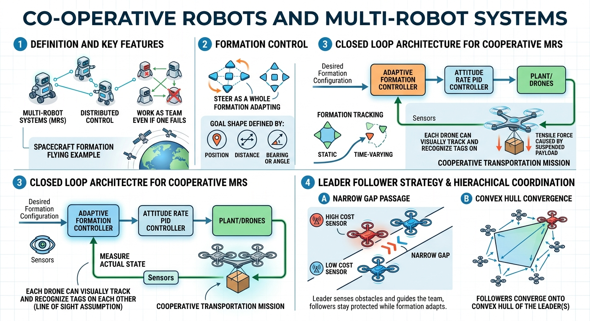

# Co-operative robots and multi-robot systems

- definition of multi-robot systems
- distributed
- work as team even if one fails
- spacecraft formation flying
- co-operative robots

- formation control
- obstacle avoidance
- steer a team of agents as a whole in a required formation

- _goal_ shape can be defined by position, distance, bearing or angle
- formation tracking
- static or time varying formation

- closed loop architecture

- co-operative transportation mission, you also capture the tensile force caused by suspended payload
- desired formation cofiguration -> adaptive formation controller -> attitude rate PID controller

- each drone can visually track and recognize tags on each other (line of sight assumption)

- leader follower strategy
- leader has high cost sensor, follower are low cost
- pass through narrow gap
- leaders sense obstacles and guide the teaml followers stay protected while formation adapts
- hierarchical coordination strategy
- converge onto _convex hull_ of the leader

J Hu et al, A decentralized cluster formation containment framework for multirobot systems, IEEE Transactions on Robotics, 2021
