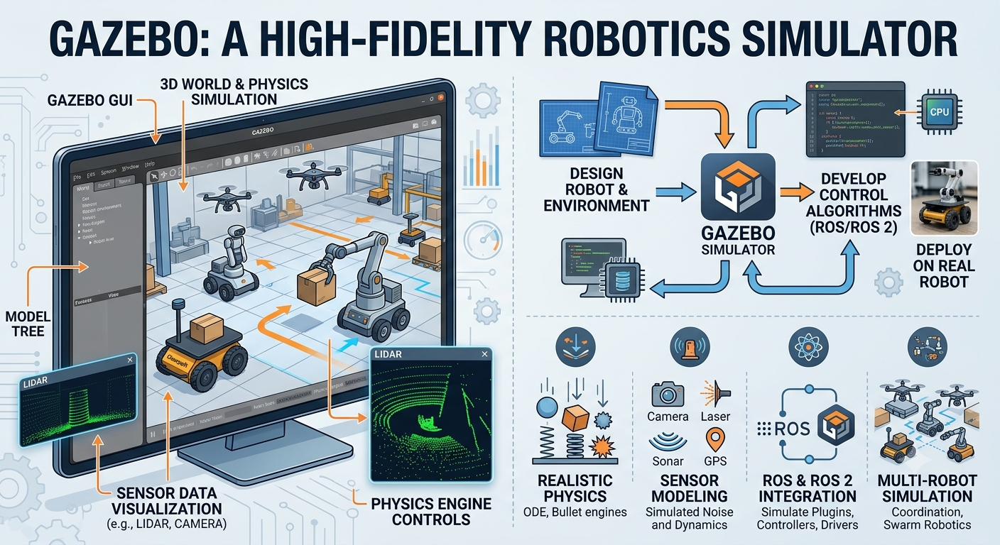

# Introduction to Gazebo in Robotics and ROS

[Gazebo](https://gazebosim.org/) is a powerful, open-source 3D robotics simulator. It acts as a virtual testing ground, allowing you to build realistic environments (worlds) and test robots, algorithms, and sensor behaviors before deploying them onto real, expensive hardware.

While Gazebo and ROS (Robot Operating System) are both heavily supported by the open-source community, they are technically **independent software projects** that integrate seamlessly through plugins.

---

## 🧱 Core Features of Gazebo

* **Physics Engine:** Computes accurate real-world physics (gravity, inertia, friction, torque) using engines like ODE or Bullet.
* **Sensor Simulation:** Simulates laser range finders (LiDAR), cameras, depth sensors, IMUs, and GPS, including configurable noise to mimic real-world errors.
* **World & Model Building:** Allows creation of complex indoor or outdoor settings (houses, offices, rugged terrains) populated with objects and obstacles.
* **SDF Format:** Natively reads Simulation Description Format (SDF) to construct robot profiles, environments, and ambient properties.

## 📚 📝 🎥 Video and Tutorial

- [🎥 video](https://www.youtube.com/watch?v=laWn7_cj434)
- [📚 📝 tutorial](https://articulatedrobotics.xyz/tutorials/ready-for-ros/urdf/)

---

## 🔄 How Gazebo Integrates with ROS

In a typical development workflow, **ROS acts as the robot's "brain,"** while **Gazebo acts as the "physical world."** 

They communicate directly via a bridge package called `gazebo_ros_pkgs`. This integration translates virtual data into standard ROS architecture:

* **Actuators:** Your ROS navigation or control nodes send movement commands (like `geometry_msgs/Twist`). The ROS-Gazebo plugin receives these commands and applies physical forces to the virtual robot's joints.
* **Sensors:** The simulated LiDAR or camera inside Gazebo captures the virtual surroundings and publishes that data straight to standard ROS topics (like `/scan` or `/camera/image_raw`). 
* **Simulation Time:** Gazebo publishes a `/clock` topic. By setting the ROS parameter `use_sim_time` to `true`, all ROS nodes synchronize to the simulation’s pace rather than your computer's real-time clock.

---

## 🆚 Gazebo vs. RViz (Crucial Distinction)

Beginners often confuse Gazebo with **RViz** (ROS Visualization). They serve completely different purposes:

| Feature | Gazebo | RViz |
| :--- | :--- | :--- |
| **What it is** | A **Simulator** | A **Visualizer** |
| **Purpose** | Simulates a fake world and fake physics. | Shows you what the robot *thinks* is happening. |
| **Data Generation** | **Generates** synthetic sensor data and physics. | Only **displays** existing data (e.g., drawing actual laser point clouds). |
| **Use Case** | Testing code when you don't have a real robot. | Watching a live map form while a real (or simulated) robot drives. |

---

## ⚠️ A Note on Versions: Classic vs. Modern

If you are looking up documentation, you will see a naming split:

1. **Gazebo Classic (Versions 1 through 11):** The legacy codebase. Gazebo 11 was the final major release of this architecture and reached its official end-of-life in 2025.
2. **Modern Gazebo (Formerly "Ignition Gazebo"):** A completely rewritten, modular suite designed for modern robotics frameworks. The latest versions (like *Harmonic* or *Ionic*) are built to integrate natively with **ROS 2**.
