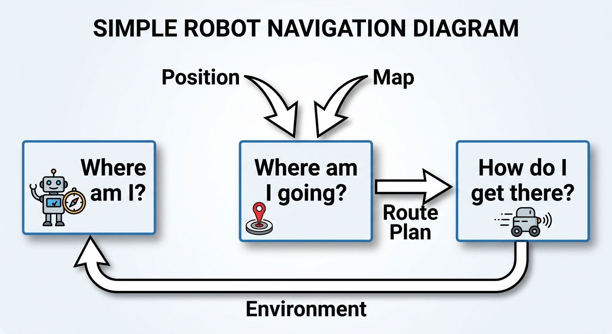
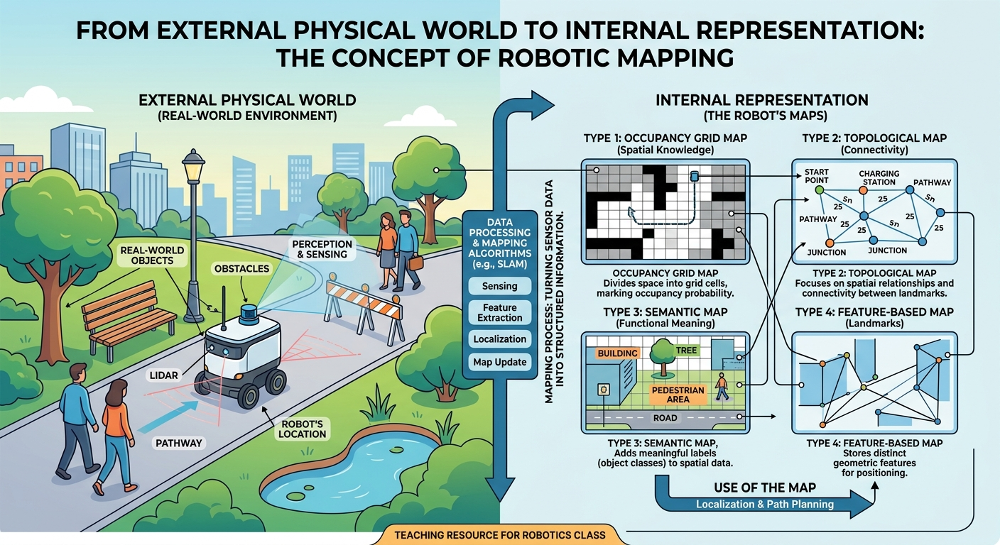
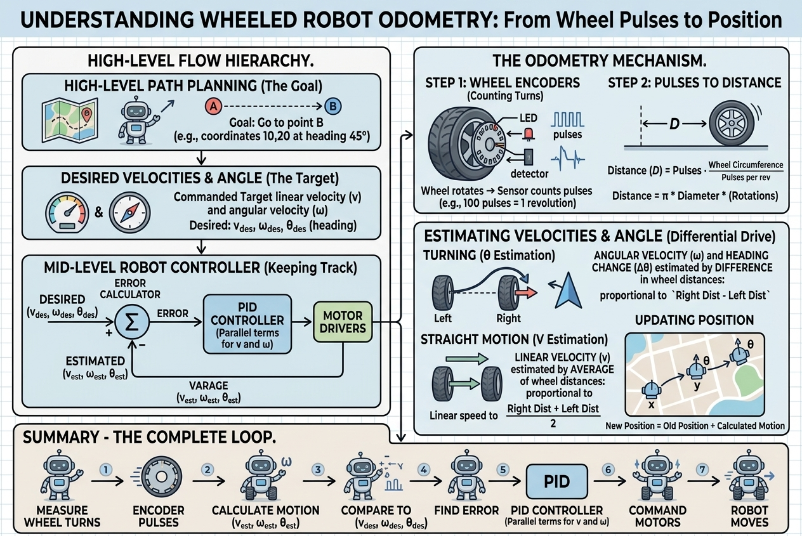
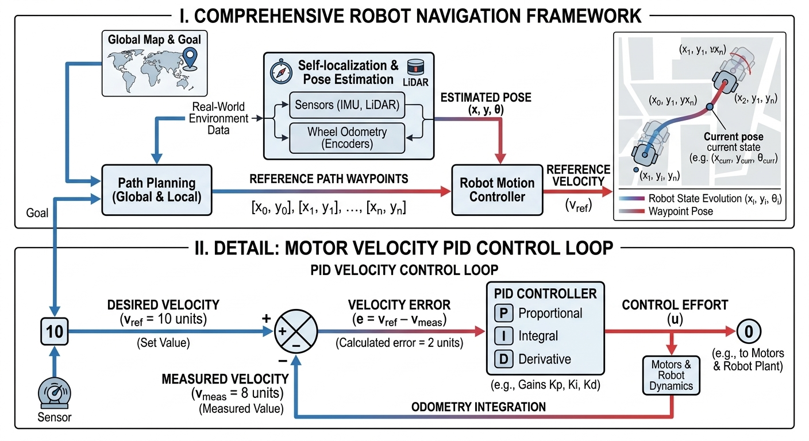
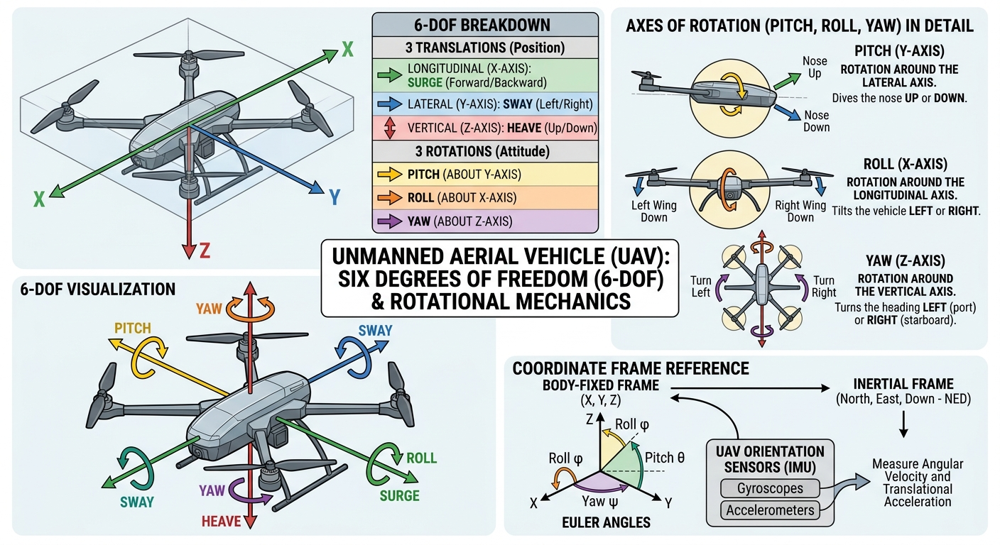
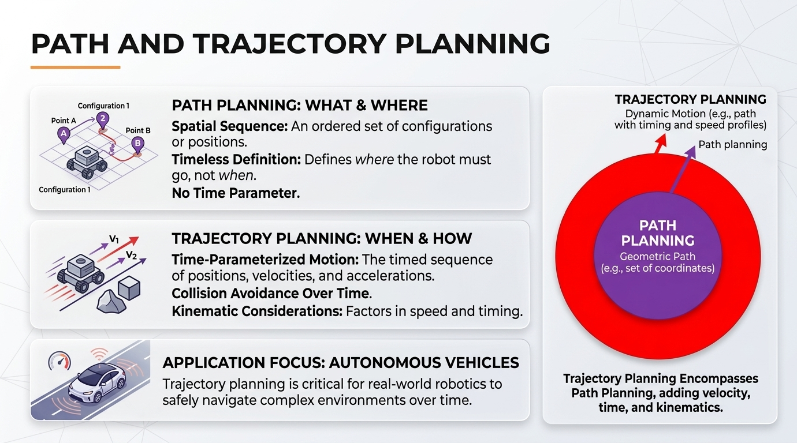
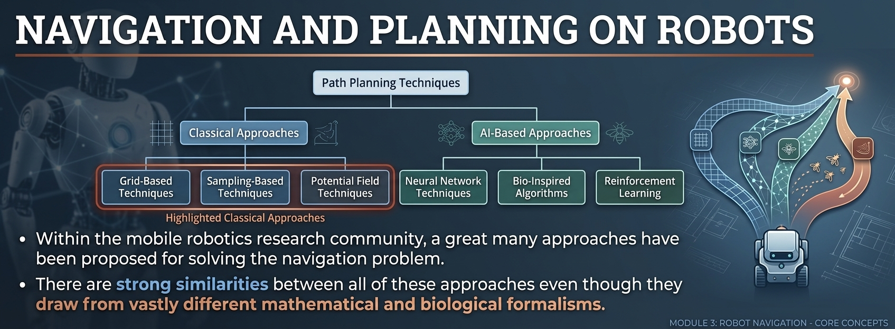
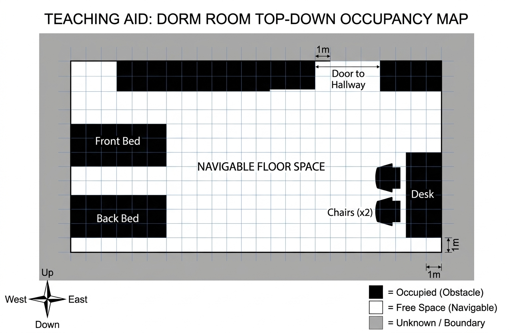

# Navigation

- navigation and planning

- relative to other locations

- path planning

- self localisation

- map is a `mapping` from the real world to some internal _representation_

- PID controller Proportional Integrative and Derivative 

- [odometry](odometry.md)

- these get translated to right and left wheel velocities

- this is what guides the robot from where it is to where it needs to go

- generate a series of _x, y_ values to guide a robot

- `self localization`

- path planner

- path planning is different from trajectory planning

- aerial drones have 6 degrees of freedom pitch, roll and yaw

- balance shorter term goals with long term for path planning

- path planning is a subset of trajectory planning

- some path planning techniques 

- reinforcement learning: control strategies that work get reinforced

## What is required 

- a global map
- robot must know where it is in the map
- start
- goal

## Occupancy map

- exploration of environment

- position estimation using robot pose

- sensor values interpret (LIDAR, sonar, vision, etc.)

- integration of sensor values into map (based on distance from robot and pose estimation of robot)

- what happens to table? robot can go underneath. the choice is with you

- divide into grids

## Next resource

- now see [SLAM resource](SLAM.md)

