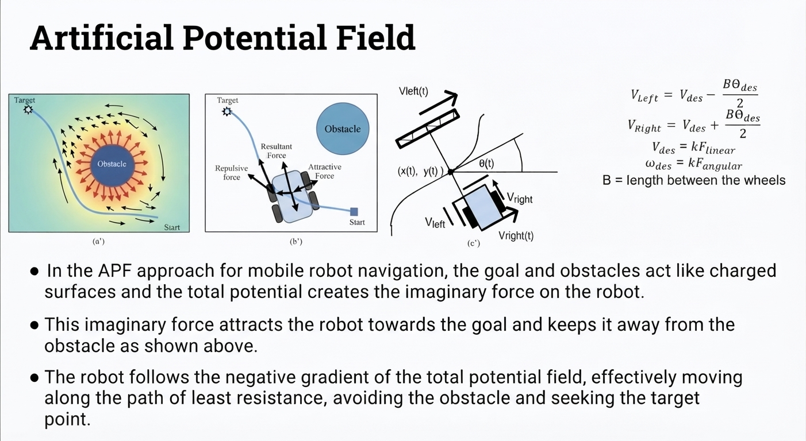
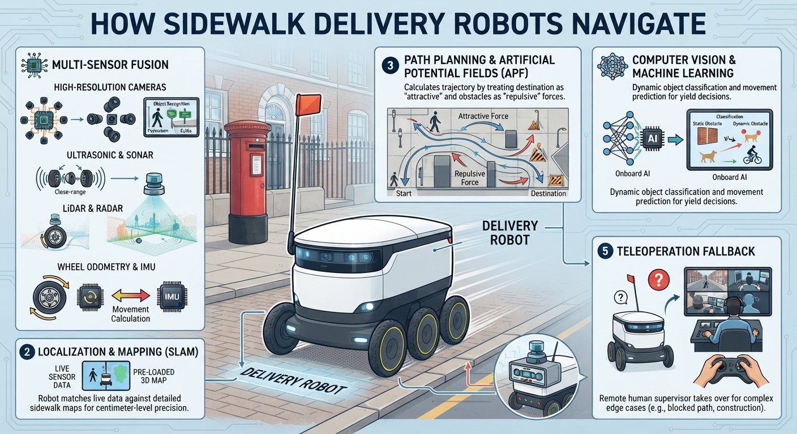

# Navigation

- navigation and planning

- relative to other locations

- path planning

- self localisation

- map is a `mapping` from the real world to some internal _representation_

- PID controller Proportional Integrative and Derivative 

- [odometry](odometry.md)

- these get translated to right and left wheel velocities

- this is what guides the robot from where it is to where it needs to go

- generate a series of _x, y_ values to guide a robot

- `self localization`

- path planner

- path planning is different from trajectory planning

- aerial drones have 6 degrees of freedom pitch, roll and yaw

- balance shorter term goals with long term for path planning

- path planning is a subset of trajectory planning

- some path planning techniques 

- reinforcement learning: control strategies that work get reinforced

## What is required 

- a global map
- robot must know where it is in the map
- start
- goal

## Challenge question

- [how does a submarine navigate underwater without GPS?](inertial_navigation.md)

## Occupancy map

- exploration of environment

- position estimation using robot pose

- sensor values interpret (LIDAR, sonar, vision, etc.)

- integration of sensor values into map (based on distance from robot and pose estimation of robot)

- what happens to table? robot can go underneath. the choice is with you

- divide into grids

- binary (occupied/not occupied) within each cell

## Artificial potential fields

- force that will push it away

$$V_{Left} = V_{des} - \frac{B \theta_{des}}{2}$$

$$V_{Right} = V_{des} + \frac{B \theta_{des}}{2}$$

$$V_{des} = k F_{linear}$$

$$\omega_{des} = k F_{angular}$$

B = length between the wheels

* In the APF approach for mobile robot navigation, the goal and obstacles act like charged surfaces and the total potential creates the imaginary force on the robot.
* This imaginary force attracts the robot towards the goal and keeps it away from the obstacle as shown above.
* The robot follows the negative gradient of the total potential field, effectively moving along the path of least resistance, avoiding the obstacle and seeking the target point.

- 🤔 ❓disadvantage

- need to know map before you setup potential field 

- what will happen when you change target

- all stored in memory 

- number of cells required ; how will this scale as you go to bigger environments 

- [🎥 video of delivery robot](https://youtube.com/shorts/2biHFlMQmrE)

- 🤔 ❓how does this delivery robot navigate?

- [🎥 video explaining how delivery robots navigate using artificial magnets](https://youtube.com/shorts/0ZC6JxeRvh4)

## Grid based techniques 

## Next resource

- now see [SLAM resource](SLAM.md)

