# Navigation

- navigation and planning

- relative to other locations

- path planning

- self localisation

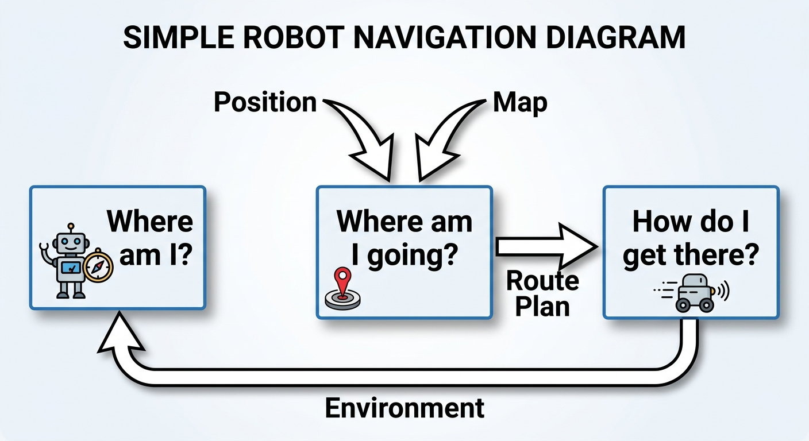

- map is a `mapping` from the real world to some internal _representation_

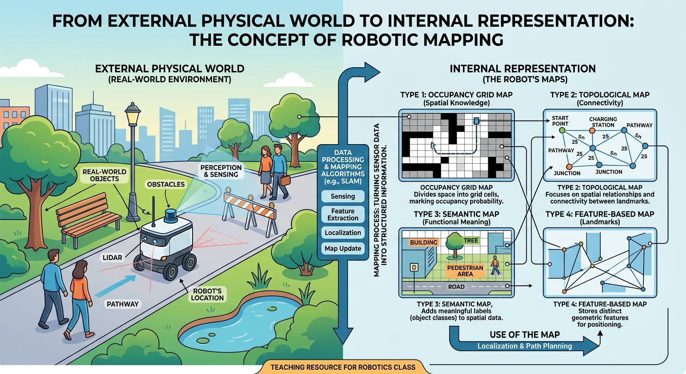

- PID controller Proportional Integrative and Derivative 

- See resource on [odometry](odometry.md)

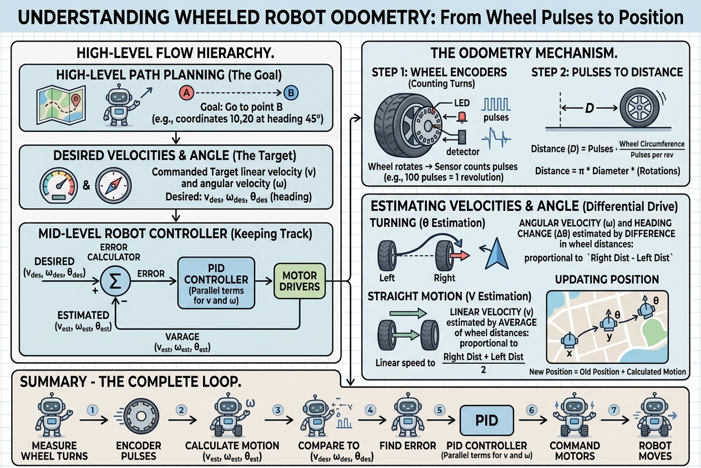

- these get translated to right and left wheel velocities

- this is what guides the robot from where it is to where it needs to go

- generate a series of _x, y_ values to guide a robot

- `self localization`

- path planner

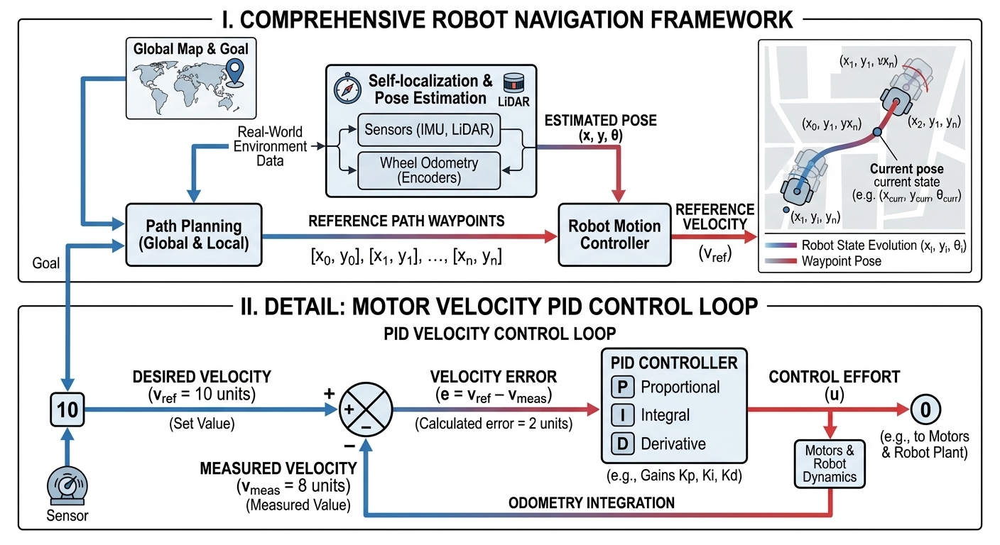

- path planning is different from trajectory planning

- aerial drones have 6 degrees of freedom pitch, roll and yaw

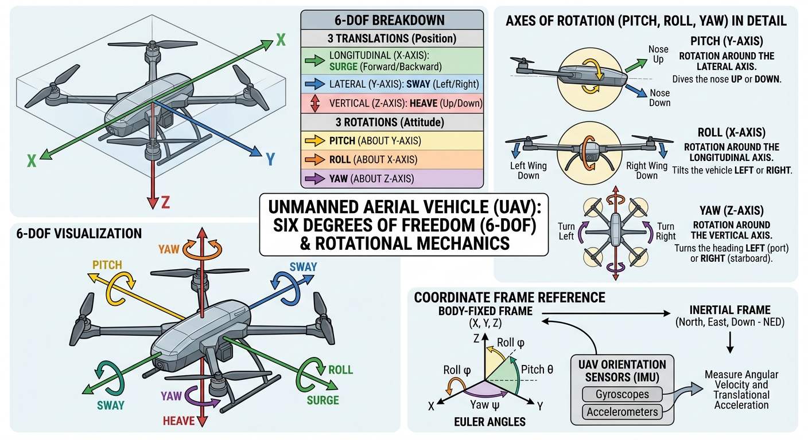

- balance shorter term goals with long term for path planning

- path planning is a subset of trajectory planning

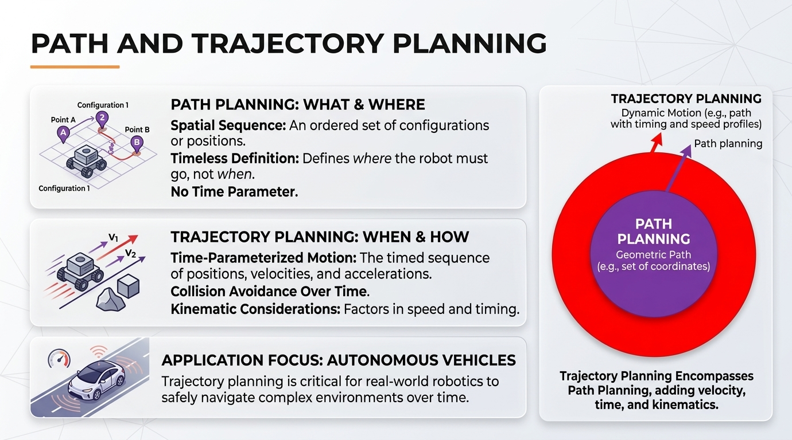

- some path planning techniques 

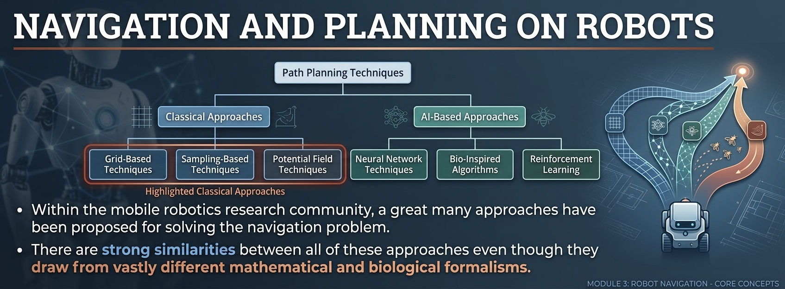

- reinforcement learning: control strategies that work get reinforced

## What is required 

- a global map
- robot must know where it is in the map
- start
- goal

## Challenge question

- [how does a submarine navigate underwater without GPS?](inertial_navigation.md)

## Occupancy map

- exploration of environment

- position estimation using robot pose

- sensor values interpret (LIDAR, sonar, vision, etc.)

- integration of sensor values into map (based on distance from robot and pose estimation of robot)

- what happens to table? robot can go underneath. the choice is with you

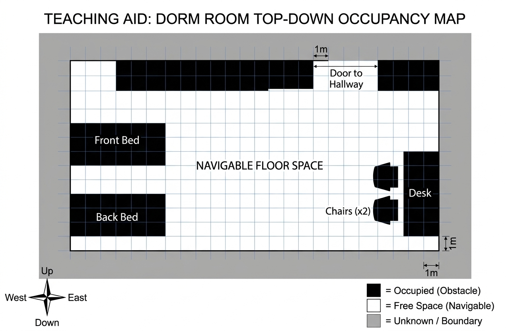

- divide into grids

- binary (occupied/not occupied) within each cell

## Artificial potential fields

- force that will push it away

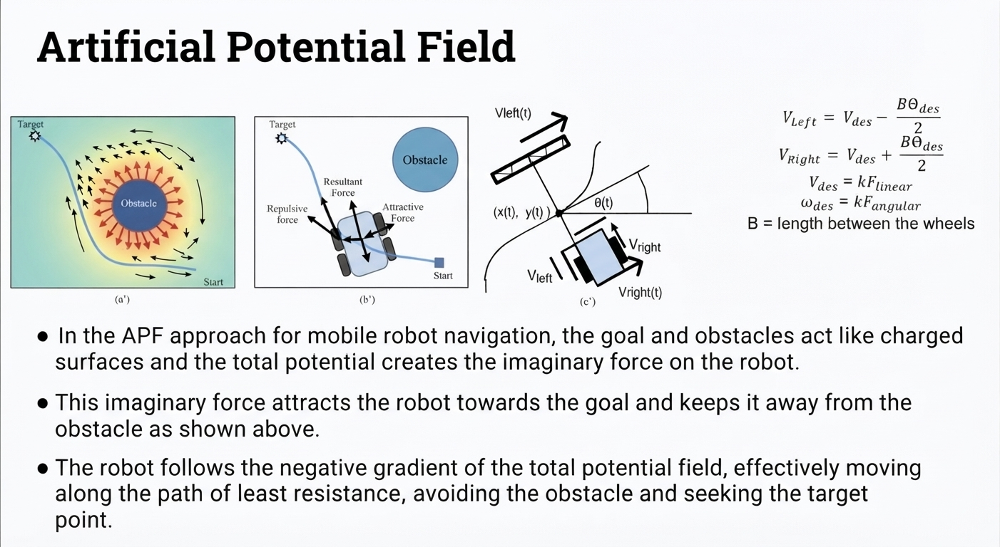

$$V_{Left} = V_{des} - \frac{B \theta_{des}}{2}$$

$$V_{Right} = V_{des} + \frac{B \theta_{des}}{2}$$

$$V_{des} = k F_{linear}$$

$$\omega_{des} = k F_{angular}$$

B = length between the wheels

* In the APF approach for mobile robot navigation, the goal and obstacles act like charged surfaces and the total potential creates the imaginary force on the robot.
* This imaginary force attracts the robot towards the goal and keeps it away from the obstacle as shown above.
* The robot follows the negative gradient of the total potential field, effectively moving along the path of least resistance, avoiding the obstacle and seeking the target point.

- 🤔 ❓disadvantage

- need to know map before you setup potential field 

- what will happen when you change target

- all stored in memory 

- number of cells required ; how will this scale as you go to bigger environments 

- [🎥 video of delivery robot](https://youtube.com/shorts/2biHFlMQmrE)

- 🤔 ❓how does this delivery robot navigate?

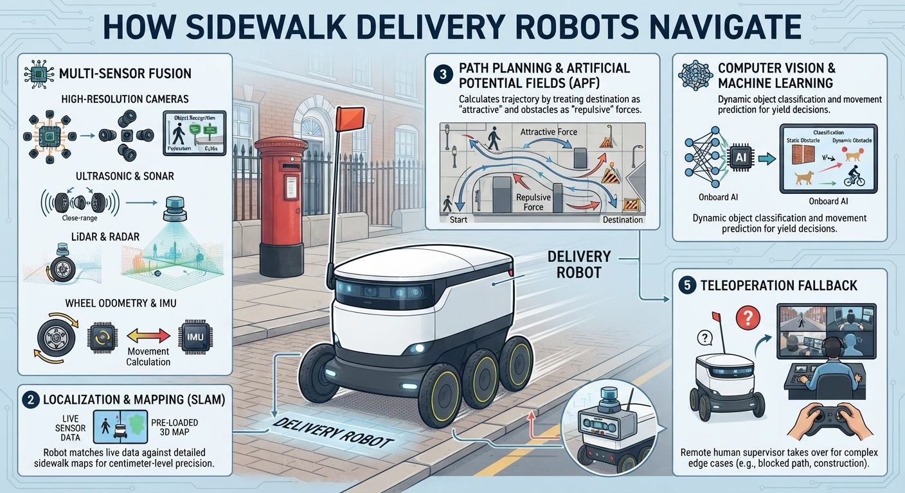

- [🎥 video explaining how delivery robots navigate using artificial magnets](https://youtube.com/shorts/0ZC6JxeRvh4)

## Grid based techniques for robot navigation 

- [🎥 video explanation](https://youtube.com/shorts/P6xDDc4QUp4)

- A* algorithm

- Dijkstra

- compute path that avoids obstacles 

- grid size depends on lots of factors

- [wavefront Dijkstra](https://www.youtube.com/watch?v=BuvKtCh0SKk&t=30s)

- 🤔 ❓what are the advantages of grid based vs. potential methods

- more flexible

- if there is new obstacle, then recompute all vectors/fields

- 🤔 ❓what is the most important thing to have in order to have a successful navigating robot?

- _Answer_: you need a _map_

- without a map, there is no way to navigate and collide with object

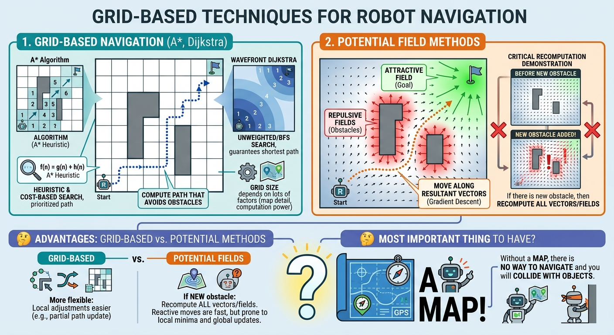

## Sample based planning

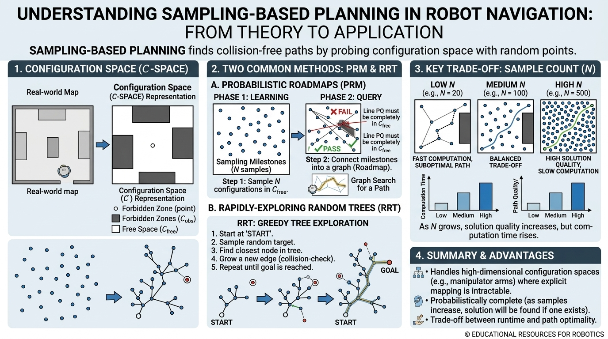

Sampling-based motion planning is a fundamental approach in modern robotics used to find collision-free paths in complex or high-dimensional environments. Rather than explicitly computing the exact boundaries of all obstacles, sampling-based algorithms approximate the reachable space by probing it with discrete random points.

---

## 1. The Configuration Space ($C\text{-Space}$)

Before planning a path, the robot's physical body and environment are represented within a mathematical space called the **Configuration Space** ($C\text{-Space}$):

* **Configuration ($q$):** A complete specification of the position and orientation of the robot.
* **Forbidden Space ($C_{obs}$):** The set of configurations where the robot collides with obstacles or violates constraints.
* **Free Space ($C_{free}$):** The set of valid configurations where the robot can safely exist ($C_{free} = C \setminus C_{obs}$).

> **Goal:** Find a continuous trajectory $P(t) \in C_{free}$ connecting a start configuration $q_{start}$ to a goal configuration $q_{goal}$.

---

## 2. Core Sampling Algorithms

### A. Probabilistic Roadmaps (PRM)
PRM is a **multi-query** algorithm best suited for static environments where multiple path queries will be performed.

1. **Learning Phase:**
   * Sample $N$ random configurations (milestones) across $C$.
   * Retain samples that lie within $C_{free}$.
   * Connect neighboring milestones with straight line segments $PQ$, keeping only those lines that lie entirely within $C_{free}$ (collision checking).
2. **Query Phase:**
   * Connect $q_{start}$ and $q_{goal}$ to the generated roadmap graph.
   * Run standard graph search algorithms (e.g., $A^*$ or Dijkstra's) to find the shortest path.

### B. Rapidly-exploring Random Trees (RRT)
RRT is a **single-query** algorithm designed to quickly discover paths from a specific start state by growing a tree into unexplored areas.

1. Initialize a tree root at $q_{start}$.
2. Sample a random point $q_{rand} \in C$.
3. Find the nearest existing node $q_{near}$ in the tree.
4. Extend a short step from $q_{near}$ toward $q_{rand}$ to form $q_{new}$.
5. If the edge between $q_{near}$ and $q_{new}$ is within $C_{free}$, add $q_{new}$ and the edge to the tree.
6. Repeat until the tree reaches $q_{goal}$.

---

## 3. The Central Trade-Off: Sample Count ($N$)

The performance of sampling-based planners depends heavily on the chosen sample density ($N$)
---

## 4. Key Advantages

* **High Scalability:** Scales efficiently to high-dimensional spaces (e.g., multi-joint robotic arms) where explicit obstacle modeling is computationally intractable.
* **Probabilistic Completeness:** If a valid path exists, the probability that the algorithm finds it approaches $100\%$ as the number of samples increases.
* **Efficiency:** Avoids costly geometric calculations by relying on fast point-wise collision checking.

## Next resource

- now see [drones indoor](drones_indoor.md)

- now see [SLAM resource](SLAM.md)

