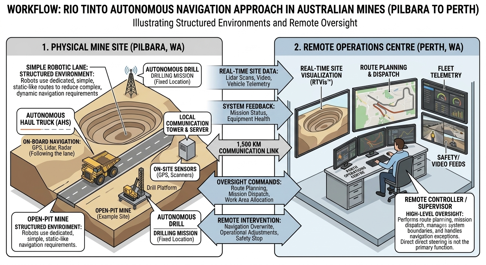

# The case of Rio Tinto




One important teaching point is that **Rio Tinto does not primarily use the kind of reactive grid-potential-field obstacle avoidance students might implement in a small mobile robot**. Its mining vehicles operate in a highly structured environment, so autonomy is based heavily on **predefined routes, high-precision positioning, fleet-level coordination, sensing, geofencing and safety rules**, with obstacle detection and emergency stopping layered on top.

## 1. The Rio Tinto "Mine of the Future"

Rio Tinto's Pilbara operations are probably the best case study to introduce.

At its Gudai-Darri mine, for example, Rio Tinto operates:

* **23 Caterpillar 793F autonomous haul trucks**
* autonomous drilling systems
* autonomous water carts
* autonomous rail
* robotic laboratory systems
* remote operations from Perth, approximately **1,500 km away**


Rio Tinto describes the trucks as being controlled by a supervisory system and central controller rather than a driver. The trucks use **predefined GPS courses** to navigate haul roads and intersections, while the system maintains knowledge of vehicle locations, speeds and directions. ([riotinto.com][1])

A particularly useful official overview is:

[Rio Tinto — Look inside a mine of the future](https://www.riotinto.com/en/news/stories/look-inside-future-mine?utm_source=chatgpt.com)

and:

[Rio Tinto — Western Australia autonomous operations](https://www.riotinto.com/operations/anz/western-australia?utm_source=chatgpt.com)

---

# 2. A useful way to map Rio Tinto onto your robotics lectures

I would actually structure the case study around the standard autonomous-robot pipeline:

**Perception → localisation → world representation → planning → control → safety → fleet coordination**

| Your robotics topic        | Rio Tinto example                                                  |
| -------------------------- | ------------------------------------------------------------------ |
| Sensors                    | GPS, cameras, vehicle sensors, monitoring systems                  |
| Localisation               | GPS + infrastructure/network information                           |
| Mapping                    | Digital representation of haul roads, intersections, mine geometry |
| Path planning              | Predefined haul routes and intersection plans                      |
| Obstacle avoidance         | Vehicle tracking, cameras, collision-avoidance/safety systems      |
| Motion planning            | Speed, braking, turning and road constraints                       |
| Multi-robot systems        | Fleet of autonomous trucks interacting with one another            |
| Remote supervision         | Perth Operations Centre                                            |
| SLAM                       | Less central than in an indoor mobile robot                        |
| Safety layer               | Geofencing, alarms, stopping, exclusion zones                      |
| Planning under uncertainty | Changing mine geometry, traffic and environmental conditions       |

This gives you a nice contrast with the usual **TurtleBot/Roomba-style autonomy problem**.

The environment is not an arbitrary unknown world.

It is a **semi-structured world designed to make autonomy tractable**.

---

# 3. Obstacle avoidance is particularly interesting

This is where I would be careful with the terminology in your lecture.

Rio Tinto says that its autonomous trucks use **pre-defined GPS courses** and know the positions, speeds and directions of vehicles around them. ([riotinto.com][1])

So conceptually you can think of the problem as:

[
\text{known road network}
+
\text{vehicle localisation}
+
\text{dynamic-object tracking}
+
\text{safety constraints}
\rightarrow
\text{safe trajectory}
]

rather than:

[
\text{laser scan}
\rightarrow
\text{occupancy grid}
\rightarrow
\text{potential field}
\rightarrow
\text{velocity}.
]

That distinction could make a very good lecture discussion.

### A simple conceptual architecture

```text
                    MINE DIGITAL MODEL
                           │
                           ▼
                  ┌─────────────────┐
                  │ Route / Mission │
                  │    Planning     │
                  └────────┬────────┘
                           │
                           ▼
                  ┌─────────────────┐
                  │ Path / Speed    │
                  │    Planning     │
                  └────────┬────────┘
                           │
             ┌─────────────┴──────────────┐
             ▼                            ▼
       LOCALISATION                 PERCEPTION
       GPS / sensors              vehicles / hazards
             │                            │
             └─────────────┬──────────────┘
                           ▼
                  ┌─────────────────┐
                  │ Safety /        │
                  │ Collision Logic │
                  └────────┬────────┘
                           │
                           ▼
                       CONTROL
                           │
                           ▼
                    AUTONOMOUS TRUCK
```

The really interesting part is that **the environment itself is engineered to simplify the planning problem**.

---

# 4. AutoHaul is another fantastic case study

Rio Tinto's **AutoHaul** system is arguably even more interesting for a robotics course.

It operates roughly **200 locomotives over more than 1,700 km of track**, transporting ore between mines and ports in the Pilbara. ([riotinto.com][2])

The trains are monitored remotely from Perth.

Rio Tinto describes the system as making decisions concerning:

* speed
* train separation
* obstacles at crossings
* faults
* braking/stopping
* route operation

The trains have onboard cameras and the rail network has CCTV at public crossings. ([riotinto.com][2])

[Rio Tinto — World-first autonomous trains / AutoHaul](https://www.riotinto.com/en/news/releases/2018/world-first-autonomous-trains-deployed?utm_source=chatgpt.com)

[Rio Tinto — How did one of the world's biggest robots end up here?](https://www.riotinto.com/en/news/stories/how-did-worlds-biggest-robot?utm_source=chatgpt.com)

That second article is particularly good teaching material because Rio Tinto itself explicitly describes the train as a **giant autonomous robot**.

---

# 5. Why this isn't simply "robot + obstacle avoidance"

This is probably the most interesting conceptual lesson for your students.

Consider an autonomous mining truck encountering another truck.

A conventional robotics formulation might be:

> "There is an obstacle in my occupancy grid. How do I move around it?"

But a mining AHS can instead ask:

> "What is the state of the entire fleet, what road segment is each vehicle occupying, what are their intended trajectories, and what trajectories are permitted by the mine's operating rules?"

That changes the problem from **reactive collision avoidance** to something closer to:

[
\textbf{multi-agent planning + constrained control + safety verification}.
]

This is a much more sophisticated autonomous-systems problem.

---

# 6. Why grid potential fields are still relevant

You could nevertheless use Rio Tinto as a way of showing students **where potential fields fit and where they break down**.

Imagine a simplified mine:

```text
 ┌─────────────────────────────────────────────┐
 │                                             │
 │     Truck A → → → → →                      │
 │                         X Truck B           │
 │                           ↓                 │
 │                         ← ← ←              │
 │                                             │
 │        Haul road                            │
 │                                             │
 └─────────────────────────────────────────────┘
```

A simple potential-field controller might define:

[
U(q)=U_{\text{goal}}(q)+U_{\text{obstacle}}(q)
]

and generate:

[
F(q)=-\nabla U(q).
]

But with enormous mining vehicles you have:

* very large stopping distances
* limited manoeuvrability
* enormous vehicle inertia
* fixed haul roads
* one-way traffic
* narrow intersections
* multiple interacting vehicles

So simply "steering away from the obstacle" is not necessarily a valid solution.

This lets you ask:

> **When does reactive obstacle avoidance become insufficient, and when do we need global planning and multi-agent coordination?**

That's a very good master's-level question.

---

# 7. Benefits

Rio Tinto identifies several major benefits.

### Safety

The obvious benefit is removing people from the immediate vicinity of:

* enormous haul trucks
* drilling equipment
* blasting
* rail operations
* dust and harsh environmental conditions.

Rio Tinto reports that autonomous systems have produced substantial safety benefits and describes removing operators from hazardous environments as one of the principal motivations for automation. ([riotinto.com][3])

### Productivity

Autonomous trucks can operate continuously and consistently.

Rio Tinto reports that, in its earlier deployments, autonomous trucks averaged around **700 additional operating hours per year** and had approximately **15% lower operating costs**. ([riotinto.com][1])

### Consistency

Humans vary in:

* acceleration
* braking
* reaction time
* fatigue
* route selection
* operating style.

A machine can execute a predefined operating policy much more consistently.

### Remote operation

The Perth Operations Centre allows operators to supervise machines **1,500 km away** from the physical mine. ([riotinto.com][4])

This is a beautiful example of **supervisory autonomy** rather than the simplistic idea that "autonomous = no humans."

---

# 8. But there are significant risks

This is where I would make the case study more balanced.

### 1. Sensor failure

What happens if:

* GPS becomes unreliable?
* a camera is obscured by dust?
* a sensor fails?
* communications are interrupted?

Mining is particularly difficult because of:

* dust
* vibration
* extreme temperatures
* changing terrain
* harsh lighting.

### 2. Communication failure

The system is fundamentally connected.

A modern autonomous mine is essentially a **large cyber-physical system**.

A useful paper for your students is:

[Autonomous Haulage Systems in Mining: Cybersecurity, Communication and Safety Issues and Challenges](https://www.mdpi.com/2079-9292/10/11/1357/html?utm_source=chatgpt.com)

It discusses communication reliability, GPS attacks, cyberattacks and the dependence of autonomous mining on communications infrastructure. ([MDPI][5])

That makes a nice bridge from **robotics → distributed systems → cybersecurity**.

---

### 3. The automation paradox

Removing the driver doesn't remove the possibility of accidents.

Instead, some risks move from:

**human perception and decision-making**

to:

**software + sensors + communications + infrastructure + system integration.**

This is an important autonomous-systems principle.

The system can be extremely reliable under its assumed operating conditions but potentially fail badly outside them.

---

### 4. Changing environments

A mine isn't static.

The mine is continually:

* excavated
* expanded
* reshaped
* filled with new roads
* populated with new equipment.

Therefore the "map" itself changes.

This is a fascinating contrast with textbook SLAM.

Instead of:

> "Robot builds a map of the world."

you have:

> **"The world is continually redesigned, and the robot's map must track the changing operational environment."**

---

# 9. The most interesting risk: autonomy is partly designed into the environment

This is perhaps the biggest conceptual takeaway I'd give your students.

Rio Tinto doesn't simply take a conventional mine and put autonomous robots into it.

It increasingly **designs the mine around autonomous operation**.

The haul roads, traffic rules, vehicle routes, communications infrastructure and control centres form part of the robotic system.

This is why autonomous mining is easier than, say, autonomous driving in central London.

You can think of it as:

[
\boxed{
\text{Autonomous robot}
+
\text{structured environment}
+
\text{infrastructure}
+
\text{operational rules}
========================

\text{autonomous system}
}
]

rather than:

[
\text{Autonomous robot}=\text{robot that can operate anywhere}.
]

That's a very important distinction for an autonomous-systems course.

---

# 10. Excellent academic resources

I'd give students a mixture of **industry sources + academic literature**.

### Rio Tinto primary sources

1. [Rio Tinto — Mine of the Future / Gudai-Darri](https://www.riotinto.com/en/news/stories/look-inside-future-mine?utm_source=chatgpt.com)
   Excellent overview of autonomous trucks, drills, water carts and remote operation.

2. [Rio Tinto — World-first autonomous trains / AutoHaul](https://www.riotinto.com/en/news/releases/2018/world-first-autonomous-trains-deployed?utm_source=chatgpt.com)
   Excellent for autonomous railway systems and safety.

3. [Rio Tinto — Autonomous mining technology](https://www.riotinto.com/en/mn/about/innovation/automation?utm_source=chatgpt.com)
   Particularly useful for the technical description of GPS-based truck navigation.

4. [Rio Tinto — R&D and technology](https://www.riotinto.com/en/about/innovation/rd-and-technology?utm_source=chatgpt.com)
   Broader overview of autonomous drills, trucks and remote operation.

### Academic resources

5. [Equipment and Operations Automation in Mining: A Review](https://www.mdpi.com/2075-1702/12/10/713?utm_source=chatgpt.com)
   Good general review of automation technologies and their benefits/limitations.

6. [Autonomous Haulage Systems in Mining: Cybersecurity, Communication and Safety Issues and Challenges](https://www.mdpi.com/2079-9292/10/11/1357/html?utm_source=chatgpt.com)
   Particularly useful for the **risk/cybersecurity** part of your lecture.

7. [Geometric and Operational Design Principles for Autonomous Haulage Systems in Open-Pit Mining: A Systematic Review](https://www.mdpi.com/2673-6489/6/3/45?utm_source=chatgpt.com)
   Very useful for connecting autonomous robots to **path planning, road geometry, turning radius, braking distance and LiDAR/GPS-based perception**. ([MDPI][6])

8. [Surface Mine Planning Adaptations for the Integration of Autonomous Haulage Systems](https://www.mdpi.com/2673-6489/6/3/48?utm_source=chatgpt.com)
   Particularly interesting if you want to go beyond the robot itself and discuss **planning the environment around the robot**. ([MDPI][7])

---

## 11. A nice lecture exercise

I think you could turn this into a very effective 30–45 minute practical.

Give students a simplified mine map:

```text
              ORE FACE
        ┌──────────────────┐
        │                  │
        │       T1         │
        │                  │
        └───────┐    ┌─────┘
                │    │
                │    │
       T2 ──────┘    └────── PORT
```

Then ask them to design three increasingly sophisticated controllers:

### Level 1 — Reactive

Use an occupancy grid + potential field:

[
U=U_{\rm goal}+U_{\rm obstacle}.
]

Ask: **What goes wrong?**

### Level 2 — Deliberative

Use A* or Dijkstra to find a route through the mine.

Ask: **What happens when T2 blocks the route?**

### Level 3 — Autonomous fleet

Now give every truck:

[
(x,y,v,\theta,\text{destination})
]

and ask them to design a **multi-agent planner** that prevents collisions while minimising:

[
J =
\alpha(\text{travel time})
+\beta(\text{energy})
+\gamma(\text{collision risk})
+\delta(\text{congestion}).
]

Then introduce sensor uncertainty and communication failure.

That takes the students from:

**grid → potential field → A* → localisation → dynamic obstacles → multi-agent planning → safety-critical autonomy**

using a single real-world system.

And, importantly, it demonstrates why **industrial autonomy is not simply "put an AI into a robot."** The autonomy is distributed across the robot, sensors, map, infrastructure, communications, fleet-management system and human supervisory layer.

[1]: https://www.riotinto.com/en/mn/about/innovation/automation?utm_source=chatgpt.com "Automation | Mongolia"
[2]: https://www.riotinto.com/en/news/releases/2018/world-first-autonomous-trains-deployed?utm_source=chatgpt.com "World-first autonomous trains deployed at Rio Tinto’s iron ore operations | Global"
[3]: https://www.riotinto.com/en/about/innovation/rd-and-technology?utm_source=chatgpt.com "R&D and technology | Global"
[4]: https://www.riotinto.com/en/news/stories/look-inside-future-mine?utm_source=chatgpt.com "Look inside a mine of the future | Global"
[5]: https://www.mdpi.com/2079-9292/10/11/1357/html?utm_source=chatgpt.com "Autonomous Haulage Systems in the Mining Industry: Cybersecurity, Communication and Safety Issues and Challenges"
[6]: https://www.mdpi.com/2673-6489/6/3/45?utm_source=chatgpt.com "Geometric and Operational Design Principles for Autonomous Haulage Systems in Open-Pit Mining: A Systematic Review"
[7]: https://www.mdpi.com/2673-6489/6/3/48?utm_source=chatgpt.com "Surface Mine Planning Adaptations for the Integration of Autonomous Haulage Systems: A Review"


